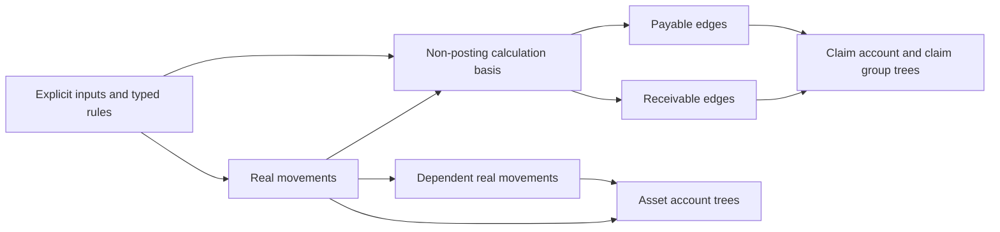

# Reusable accounting and resource blueprint

Updated 2026-09-29: accepted design direction, with explicit proof gates.
Accounting, logistics, exchange, and basic assembly are the active design scope;
CRM/HRM remain separate future modules. Start execution from the
[implementation handoff](./implementation-handoff.md). The [plan](./plan.md)
preserves earlier A1/A2 implementation evidence; those schemas still contain
the older compulsory organization/book model. This revision changes the target
contract, not the deployed schema or the recorded test results.

## 1. Stable concepts

| Concept | Contract |
|---|---|
| Identity | A stable person, organization, treasury, tax authority/component, purpose, location, item, service, or work type. A display name is an attribute, not identity. |
| Economic entity | The user or organization whose assets and obligations are described. A personal account directly references the existing user; no artificial organization or book is required. This role differs from authorization ownership in `owned_by`. |
| Dimension account | Identity plus the dimensions required to give a number meaning, such as treasury × currency or operating unit × resource. |
| Real movement | A dated change in an actual or scheduled asset/resource position. One source may project distinct deltas to several accounts and validation roots. |
| Receivable posting | A dated signed change in a claim **against one counterparty**, for one currency and economic entity. |
| Payable posting | A dated signed change in an obligation **to one counterparty**, for one currency and economic entity. |
| Calculation | A pure, declared formula over inputs. Its result is not itself an account posting. |
| Group | A business scope: invoice, payment allocation pool, shipment, production run, work order, correction note, or limit period. |
| Projection | A bounded vector of unit-correct measures from a record into one owner's tree, at one ordering key. The posting families describe measures, not a compulsory one-table/one-record split. |
| Dependency | A declared route that recalculates consumed fields after their source changes. It is separate from group membership and from AVL topology. |

Account dimensions and policy inputs are authoritative facts. Account balances
are protected aggregates, never editable opening-balance fields. Opening money,
stock, and claims use ordinary dated postings.

The user's liquid/solid distinction is useful presentation terminology, but it
should not determine the stored transaction model. Inventory is a real asset
without being liquid money; a receivable is a claim without being physical stock.
A payable is an obligation, not a bank account's required minimum balance.
Receivable/payable also do not mean accounting debit/credit.

`receivable - payable` is **net outstanding claims**, not total net assets.
Cash, inventory valuation, other assets, and liabilities must be included with
compatible units for a broader financial position. Do not subtract item counts
from money or sum different currencies.

## 2. Accounts and perspective

| Proposed record | Identity/dimensions | Maintained state when needed |
|---|---|---|
| Existing user / `organization` | Economic entity or counterparty, with distinct authorization rules | No compulsory organization-wide tree. A separate reporting book is optional only when a real requirement justifies it. |
| `treasury`, `currency` | Reusable treasury label/identity; currency identity and immutable precision | No balance merely for naming an identity. |
| `treasury_account` | Economic entity × treasury × currency | Cash history and configured floor. Currency is inherited by its transactions. |
| `tax_account` | Tax identity, jurisdiction/authority, client label/classification | Neither inherently receivable nor inherently payable. |
| `misc_account` | Named external purpose or process, such as damage, charges, or manufacturing | No assumed inventory or cash availability. |
| `claim_account` | Economic entity × user/organization counterparty, tax, or purpose identity × currency | Separate receivable/payable measures; optional precisely named real-flow measures in the same currency. |
| `operating_unit` | A stable stock-holding scope belonging to the economic entity | Optional activity reporting. A later logistics packet may add physical location hierarchy when its invariants are specified. |
| `item`, `service`, `work_type` | Distinct native resource identities with immutable units | Resource semantics belong to the selected edge recipe. |
| `stock_account` | Economic entity × operating unit/location × resource | Stock or resource quantity; capacity history for interval use. A unit may hold many resources. |
| `valuation_account` | Economic entity × stock account × currency | Optional carrying value, separately from physical quantity. |
| `exchange_pair` | Scoped ordered pair of distinct tradable resources, each a currency/item/service with a defined unit | Quote/execution history; no available balance merely because the pair exists. See section 3. |

Use `treasury`, `location`, `counterparty`, or `purpose` for the user's named
placeholder according to its meaning. Do not introduce a universal name account
or confuse a named identity with its currency/resource-scoped account.
The proposed personal entity reference is a finite native union such as
`record<rebase_user | organization>`; authorize use separately from record type.
An authorization group does not thereby become an economic organization.

Uniqueness is a schema policy. The current all-in-accounting profile selects a
multi-currency treasury account and unique
`(economic_entity, treasury, currency)`. A single-currency profile replaces
that with unique `(economic_entity, treasury)`; each policy is tested with its
own schema fixture. SurrealDB's [index syntax](https://surrealdb.com/docs/reference/query-language/statements/define/indexes)
does not provide conditional unique indexes, so policy is not a client toggle
on each row. Labels may have their own scoped unique index when wanted. Neither
a global unique name nor a unique name+currency alone proves correct identity,
ownership, or immutable currency. Changing an index/policy on populated data
requires a checked migration.
An organization identity can have several currency accounts; uniform-currency
guards belong on a chosen account/document unless a stricter policy is explicit.

Country/jurisdiction and currency are typed dimensions at the appropriate level.
A tax identity can have several currency-scoped claim accounts. This preserves a
single tax identity without adding incompatible amounts. There is no separate
table for every GST, cess, TDS, TCS, property-tax, or water-tax label. Separate
tables are warranted when the **edge's required inputs or effects** differ.

An external organization need not have a modeled bank or warehouse. Sending it
money decreases our treasury; sending it goods decreases our stock. Those facts
do not create its asset balance or automatically change our claim against it.
An optional external-flow report can project those facts without interpreting
the report as available cash or stock.

Internal transfers require compatible dimensions and the same economic entity. If both
organizations' perspectives are maintained, an explicit composition creates
their respective postings and checks correspondence. Do not silently duplicate
both perspectives on every ordinary transaction.

## 3. Source records, effects, and exchange

### One source can carry several effects

Keep deterministic 1:1 effects in one source when they share authoritative
inputs, edit/delete lifecycle, permissions, and audit meaning. Give their
measures and positions separate names; a record need not belong to only one
posting family. Different effective dates can use separate declared slots.
Separate dates alone do not require separate records.

Use child records for variable 1:N components, independently addressable
allocations/returns, or distinct lifecycle/authorization. A meaningful 1:1 child
remains valid; cardinality alone does not prove that co-location is safe.
Required children use the existing source-owned lifecycle; an ordinary reference
does not create or guarantee them. Do not keep both a co-located effect and its
old posting child active after migration.

Example: a billed outbound delivery with quantity `q` and calculated base value
`v` can contribute `real_quantity -= q` to stock, `receivable += v` to the
counterparty account and invoice, and `(q, v)` to its resource/currency pair.
A variable tax child with amount `t` can contribute `receivable += t` to that
same counterparty/invoice and `payable += t` to its tax account. The tax payable
is not another customer receivable. The invoice's base and tax memberships
must not also include a second gross `v+t` contribution.

These are per-root effects: quantities, money, claims, and reported cash flow
have distinct meanings and units. Repeating one effect in an account and a
document tree permits validation/reporting; summing both roots would double
count it. A tax account's `remitted` flow can rise when treasury cash falls,
but it is not a modeled government bank balance. Nonlinear tax basis, rounding,
and eligibility are explicit calculated inputs to these effects.

Native tables may share owner trees through a common projection contract.
Prefer a billed-delivery table with a required invoice and an unbilled/damage
table with its own required purpose. Both can feed the same stock account.
Use separate sales/purchase documents when their required shape differs;
direction follows the table/recipe and is protected, not a client bypass flag.
Extensions add finite table/slot declarations and rebuild the profile; the
engine does not accept arbitrary client-supplied schemas at runtime.

### Simple movement catalog

Let `tr` be treasury, `t` tax, `o` organization, and `m` miscellaneous. Arrows
describe the movement direction, not the sign of a receivable/payable.

| Money from → to | `tr` | `t` | `o` | `m` |
|---|---|---|---|---|
| `tr` | Allowed | Allowed | Allowed | Allowed |
| `t` | Allowed | — | — | — |
| `o` | Allowed | — | — | — |
| `m` | Allowed | — | — | — |

There are `4² - 3² = 7` money directions. Direct tax is still `t`; a cash
charge uses a real receiving endpoint, commonly `m` or `o`. They add recipes,
not primitive endpoint categories. The earlier count of sixteen therefore
does not constrain the final table count.

For resources, let `s` be a stock/resource account; external endpoints are `o,m`.

| Resource from → to | `s` | `o` | `m` |
|---|---|---|---|
| `s` | Allowed | Allowed | Allowed |
| `o` | Allowed | — | — |
| `m` | Allowed | — | — |

There are `3² - 2² = 5` resource directions, for **twelve simple directions total**.
An organization endpoint is the same identity used for money. Services and work
resources use `s`; they do not add another endpoint family.

The existing six-table catalog remains useful for simple movements. It is not
a limit on account count, posting families per record, or future table shapes:

| Table | Required endpoint types | Asset projections |
|---|---|---|
| `cash_in` | External `record<organization \| tax_account \| misc_account>` → `record<treasury_account>` | `+amount` in the treasury. |
| `cash_out` | Treasury → the same external union | `-amount` in the treasury. |
| `cash_transfer` | Treasury → treasury | Debit source, credit destination. |
| `stock_in` | `record<organization \| misc_account>` → `record<stock_account>` | `+quantity` in the stock account. |
| `stock_out` | Stock account → the same external union | `-quantity` in the stock account. |
| `stock_transfer` | Stock account → stock account | Debit source, credit destination of the same resource/unit. |

These unions require no business `if tax / if organization` branch: the external
identity does not change the asset calculation. If a concrete endpoint later
requires distinct fields or guards, split that variant. Twelve separate
direction tables would also be valid, but would currently repeat identical
contracts. Neither choice reduces tree memberships by itself.

Core movements carry required endpoints, economic entity, positive amount/quantity, and
effective time. They carry no optional invoice, tax kind, settlement mode,
or generic executable rule payload. A dependent cash charge has a required real
parent and its own appropriate endpoint shape. An invoice-linked claim has a
required invoice/group and calculation source. Unlinked movement remains simple.

Use a required-quote FX transfer variant when currencies differ. Maintain two
currency-correct amounts and explicit rounding/residual treatment; do not infer
a missing quote or combine currencies. A stock transfer cannot turn ore into
gold by choosing different source/destination subjects: that is a production
composition of separate input and output movements.

An explicitly entered two-leg exchange is another valid variant; the two
quantities determine its executed rate. It does not require an invented market
quote. Same-resource location transfers remain simple transfers.

### Directional exchange history

Normalize the sparse relationship as `exchange_pair(given_resource,
received_resource)` within an explicit visibility/economic context; require
the resource identities to differ and use a scoped unique index on the pair.
Both references can be currency, item, or service. A shared finite reference
union is sufficient; no universal tradable-object registry is required.
Product identity includes a canonical unit, so a unit change cannot silently
change a historic price. An account inherits its resource; source projections
derive the pair from the actual legs and cannot attach an unrelated pair.

For a positive two-leg execution:

```text
rate = received_quantity / given_quantity
rate unit = received_resource.unit / given_resource.unit
```

Store authoritative quantities, selected quote/version if any, effective time,
and explicit fees/rounding. Keep quote observations, invoice prices, and actual
exchange executions in separate tables or named root families. An invoice
price is not proof that payment or physical exchange has happened. Reversals
reference the original observation/execution and cannot introduce zero or
negative denominators into an ordinary rate series.

A pair can own effective-time histories for several table variants. Sum the
two quantities only within the same pair, orientation, population, and unit
policy; their ratio gives a volume-weighted executed rate when the denominator
is positive. Rates themselves are not additive, and an unweighted average of
rates is generally a different statistic. Gross, net-of-fee, canceled, quoted,
and scheduled observations require explicit query semantics. Do not create
inverse or cross-currency facts automatically; avoid recursive quote feedback.
Organization/resource identity trees remain optional reports, never mixed-unit
balance trees. Multi-input assembly is a recipe with several legs, not one
pairwise rate that somehow allocates all costs.

Dependent variants are a finite catalog of contracts, rather than a Cartesian
product of every optional feature:

| Recipe family | Required source/context | Posting effect |
|---|---|---|
| Explicit receivable / explicit payable | Claim account, entered amount and time | Open that one claim family. |
| Priced-resource receivable / payable | Real resource source, pricing inputs, matching document scope | Claim from the priced quantity; no extra resource movement. |
| Parent tax receivable / payable | Real source, typed rate/rule and tax claim account | Claim from that source basis. |
| Aggregate tax receivable / payable | Published non-posting basis and tax claim account | Claim from a group/compound basis. |
| Receivable cash allocation / payable cash allocation | Real cash source pool and target claim scope | Reduce the selected outstanding family. |
| Parent cash charge / prefix cash charge | Real parent, receiving endpoint, parent-only or earlier-prefix rule | Another real cash movement. |
| Real refund / resource return | Original real source and its shared capacity scope | Reverse real assets within original capacity. |
| Receivable amendment / payable amendment | Explicit delta or permitted real/calculation basis and target scope | Change that claim family without silently changing cash/stock. |
| Production output | Real input basis, recipe, process endpoint and output stock account | Future real stock-in. |

Each row describes an effect contract, not a required separate record. Combine
contracts in a concrete source when authoritative inputs, lifecycle, permission
and audit boundaries match; split when those boundaries or required shape differ.
Fixed, proportional, capped, and compound formulas can likewise have small
concrete contracts. Shared arithmetic does not require an optional-field
mega-schema or a runtime `kind` interpreter.

## 4. Posting algebra and financial meaning

Use positive input amounts for opening and settlement recipes. The table's
projection determines the signed delta. An explicit amendment can accept a
signed delta, while preserving its receivable/payable family.

| Event | Cash | Receivable | Payable |
|---|---:|---:|---:|
| Open customer claim of 100 | 0 | +100 | 0 |
| Receive 60 against that claim | +60 from real movement | -60 from settlement edge | 0 |
| Open supplier obligation of 100 | 0 | 0 | +100 |
| Pay 60 against that obligation | -60 from real movement | 0 | -60 from settlement edge |
| Recognize input tax credit of 18 | 0 | +18 against tax account | 0 |
| Recognize output tax of 18 | 0 | 0 | +18 to tax account |
| Refund an allocated customer receipt of 20 | -20 from real refund | +20 when reopening that claim | 0 |
| Reduce an unpaid customer invoice by 10 | 0 | -10 | 0 |

The movement/allocation labels describe logical effects; compatible effects
can live on one source. This table does not prescribe separate records.

A water-tax payment closes a payable. It creates a receivable only when there
is a separately justified advance, refundable excess, or credit entitlement.
Settlements do not manufacture assets by creating opposite claims.

Require receivable and payable outstanding histories to remain nonnegative
within each guarded scope. Exceeding a claim does not silently flip its type.
Customer advances create payables; supplier advances create receivables through
explicit real-dependent recipes. Credit balances and deposits remain visible.

Query `R(t)` and `P(t)` from the same claim account's ordered summary and compute
`R(t) - P(t)` in the response. Keep **no independently editable net field**.
A protected derived field is optional for a concrete index/query need; an
intra-record expression suffices for a condition on that record's own deltas.

A historical bound on account net is different. Add the derived measure
`net_delta = receivable_delta - payable_delta` to that owner's existing tree
and guard its `instant_min`/`instant_max` at complete timestamps. Every source
table affecting either family must contribute the corresponding net delta.
This adds summary width, not a fourth authoritative posting family or normally
another tree/record. A dated changing limit can instead use a dated headroom
measure with its own explicit policy. An arbitrary nonlinear constraint may
need different algebra; do not pretend every formula is a bounded monoid.

Counterexample: `R += 100` at t1 and `P += 100` at t2 end with net zero, but net
was 100 in between. Reversing the event order gives the same independent R/P
sums and extrema but net never exceeds zero. Subtracting component extrema
cannot recover the exact net extrema. The domain net-bound fixture is pending.
Optional
gross-created, settled, or written-off measures are justified only by a report
or invariant; they are not inferred from the absolute values of signed postings.

### Recognition, due dates, and future time

`effective_at` says when a posting changes its balance. `due_at`, when needed,
says when settlement is expected. A liability can exist now and be due later.
The client can also enter a future-effective liability explicitly. These are
different choices, so do not silently replace recognition time with due time.

Future real movements and dependent outputs participate immediately in the
ordered history at their future keys. An as-of query includes only the requested
period; a whole-tree sum includes future records. Passage of wall-clock time
does not create another fact or imply that a physical action was performed.

Liquidity forecasting uses due obligations and explicitly scheduled real
movements. A payable does not choose which treasury funds it. A separate due-date
ordering or forecast tree costs additional memberships and is added deliberately.

## 5. Dependency rules

There are three distinct relationships:

1. **Reference/grouping:** an edge belongs to an invoice or names an opponent.
2. **Calculation:** consumed source fields determine amount, account, or time.
3. **Validation:** a scope's aggregate constrains otherwise explicit values.

Naming a claim group to allocate a payment does not mean its balance calculates
the payment amount. A source payment remains the explicit real fact.

| Calculation source | Allowed outputs |
|---|---|
| Explicit client inputs | Independent real, receivable, or payable postings. |
| Real movement | Dependent real movement, receivable, payable, or non-posting calculation. |
| Pure calculation over permitted inputs | The same outputs permitted by its actual input ancestry. |
| Receivable/payable posting or outstanding balance | Validation, selection, and reporting; no automatic real movement or another claim's amount. |

The last row preserves the requested prohibition on real-from-claim and
payable-from-receivable calculations. A calculation wrapper cannot hide a
prohibited dependency. It may legitimately read an explicitly declared
assessment input that also produces claims.

This is the retained domain recipe policy, not an AVL restriction or a limit
of two effects per source. Co-located sibling effects derive from shared inputs;
neither has to read the other's outstanding-account aggregate.

This chosen restriction has a real scope cost: automatic interest on an
outstanding receivable would require a claim-to-claim calculation. It is not
included under this matrix. Adding it later requires an explicit causal rule
extension and temporal proof; relabeling the balance as a calculation basis
would not satisfy the prohibition.



Tax-on-tax is a dependency between **calculated amounts**, with ledger postings
as outputs. For example `base → tax1_amount → tax2_amount`, then independent
receivable/payable projections of the calculated amounts. It has genuine
calculation depth even if every posting is grouped under the same invoice.

For parent-only rules, consume the real parent and a typed rule record directly.
Use a non-posting calculation record only when it has a purpose: shared compound
basis, aggregate input, or a separate valuation. Do not mandate another 1:1
invoice-line wrapper for every delivery or claim.

The first H4a implementation applies this rule to `sales_invoice_issue`. Its
parent-local pre-tax base is the sum of that issue's already currency-rounded
line amounts; it never reads invoice outstanding or another tree summary. A
component explicitly selects an immutable, effective-dated rule version and
produces either one fixed amount or a proportional amount rounded at the
invoice currency precision. Recognition is the issue date. This does not add
aggregate-tree or tax-on-tax bases; those remain H4b. The H2 purchase-receipt
fixed-tax recipe remains the purchase control until its direct slots are
replaced in a separate packet.

### Aggregate inputs without feedback

The safe group pattern is:

```text
real inputs → group's input tree → published calculation basis → outputs
```

Outputs participate in their account and validation trees, **not in the input
tree that calculates them**. In particular, changing an input subtotal must not
make a generated charge include itself in its own whole-tree basis.

The current compiler allows a table without memberships to consume a referenced
published summary. It rejects direct tree-summary consumption from a table that
has memberships. Therefore use a typed, tree-less basis record between an input
summary and output postings. That record has `m = 0` but contributes to reactive
work. Do not bypass the guard with an opaque helper.

Earlier-prefix calculations are a distinct supported pattern. They need an
explicit prefix-reading membership and use the strict key before that member.
Later affected prefix consumers must refresh, including consumers after an
unchanged capped result. Prefix sweeps currently cannot reposition nodes;
production completion dates should depend on published input summaries, not
on a prefix rule that moves its own key during a sweep.

### Native implementation contract

Use `SCHEMAFULL`, finite `record<A | B>` unions, native indexes and references,
and the existing annotations:

| Annotation | Use |
|---|---|
| `@rebase-tree-root` | Aggregate and guard owner. |
| `@rebase-tree-node` | One protected membership position. |
| `@rebase-members fn::...` | Pure projections into the selected owners. |
| `@rebase-derived` | Protected derived field. |
| `@rebase-depends ref.field` | Consumed fields hidden inside helper calls. |
| `@rebase-validate fn::...` | Guard after the source's reactive closure settles. |
| `@rebase-required-outputs fn::...` / `@rebase-managed-output` | Reconcile stable source/role children, protected by native `PERMISSIONS NONE`. |

Reactive references are scalar, typed, top-level `REFERENCE` fields. Materialize
multi-hop dependencies one hop at a time, order local shadows before consumers,
and make untracked dimensions immutable. Do not encode arbitrary formulas,
account types, field names, or table names as a client-controlled JSON interpreter.

The engine refreshes existing dependents and can reconcile required source-owned
outputs. C2c/d have recorded compiled lifecycle and aggregate-basis proofs.
These are generic capabilities: new tax, refund, and assembly recipes still
need their own mutation, deletion, authorization, and rollback checks.

### Declarative stages and validation boundaries

Author the domain in this order; reuse the existing compiler passes rather than
adding a schema-overlay language:

1. Native strict tables, typed references, units, immutable identities, scoped
   indexes, and the source fields users may edit.
2. Local pure derived fields and declared one-hop dependencies. C3 orders
   local derived fields for CREATE and refresh; declaration/file order alone
   is not an evaluation contract.
3. Finite root families, protected slots, complete membership coverage,
   measures/tags/spans, and published bases where needed.
4. Local field checks, then settled record/root guards and required-output
   lifecycle. Review old/new owner repair, deletion, and concurrency together.

| Constraint | Enforcement location |
|---|---|
| Shape, scalar range, positive quantity, different pair resources | Native type/`ASSERT`; use ordered derived fields when inputs are calculated. |
| Existence/deletion, economic entity, unit and reference compatibility | Typed `REFERENCE`, explicit local/final guards, immutable dimensions or declared refresh routes. |
| Account uniqueness | Scoped native unique indexes; no scan-then-create race. |
| Invoice members share counterparty, currency, entity and direction | Mandatory projections/tags plus final uniformity **and comparison to the header's expected values**; reject missing required tags. |
| Net floor, stock floor, allocation/return cap, interval capacity | Settled root summary, complete timestamp policy, `@rebase-validate`. |
| Complete set of required child effects | Source-owned reconciliation and one final closure validation. |
| Who can create/use/read each fact or dimension | Native permissions and explicit authorized source/reference checks; calculation inheritance is not permission inheritance. |

Defining a field again later with `ASSERT` does not postpone that assertion
until all trees/children settle. Root/node storage fields must be declared once;
the compiler rejects native value/assert overrides on generated tree storage.
Use the final validation hook for aggregate conditions. Synchronous native
events share the triggering transaction; `ASYNC` events cannot enforce this
same-write invariant ([SurrealDB event contract](https://surrealdb.com/docs/reference/query-language/statements/define/event)).
Native fields supply the local type/value/assert mechanisms
([field contract](https://surrealdb.com/docs/reference/query-language/statements/define/field));
ReBase's closure ordering is a separately implemented and probed contract.

For implicit participation, a tax child inherits document and commercial
counterparty through declared derived references; its tax authority is a
different field. Materialize mutable multi-hop paths one hop at a time. Direct
dereferencing in a membership helper does not register all intermediate changes.
Prove reparenting removes old account/document/ancestor positions before adding
the new ones and preserves the same rollback boundary. Limit/header-only edits
also run final guards; descendant recomputation requires the declared routes.

A hierarchy of ten levels is possible only as ten justified, tracked scopes.
It is not a fixed cost guarantee: changing one parent may visit many descendants.
Send each fact directly to each needed root; never feed a subtotal and its
underlying facts into the same measure. Root/table unions stay finite and
schema-owned. Adding a new table must enroll all applicable invariants, not
merely the easiest stock tree.

## 6. Groups, capacities, invoices, and settlement

A group must state its dimensions, its members, the meaning of every measure,
and the invariant that earns its tree. A document reference used only for
navigation can use native indexes without an aggregate tree.

Membership coverage is part of the invariant. Once a capacity or payment policy
applies to an account/source class, every qualifying edge must participate by
schema-owned projection or a required source-owned participant. A client cannot
evade a limit by omitting an optional grouping reference. Activating or changing
a policy on populated data must enroll/revalidate all affected facts atomically,
or reject activation until a separately validated preparation is complete.

| Scope | Dated contributions | Guard |
|---|---|---|
| Treasury | Cash in/out | Historical/future cash floor. |
| Stock account | Resource in/out | Quantity never below zero when configured. |
| Receivable/payable account | Signed changes to each claim family | Each outstanding measure stays nonnegative. |
| Receivable/payable group | Opens, amendments, allocations, restorations | Cannot consume another invoice's capacity or oversettle this scope. |
| Payment allocation pool | Original leg amount, allocations, refunds, allocation reversals | Available amount for allocation never negative. |
| Movement return scope | Original quantity and returns | Cannot return more than the source supplied, or return before supply. |
| Correction note | Referenced amendments with exact dimensions and dates | Required associations, currency, and date bounds agree. |
| Production input requirement | One resource's inputs and required consumption for outputs | Outputs cannot consume unprovided inputs. |
| Capacity/limit scope | Dated capacity, uses, releases | Weighted load stays within its configured bound. |

Invoice variants are concrete receivable/payable groups with their required
metadata and policies. A posted base claim or tax component is already a line.
Several lines can share one delivery, several deliveries can support one grouped
basis, and standalone service/other claims need no stock movement at all.
Any billed-quantity allocation must have its own shared source-capacity guard;
a foreign key alone does not prevent billing the same quantity twice.

An invoice's customer/supplier outstanding tree contains only that party's
claim components and their consumption. Tax-authority claims use their own
account/scope; they may share the invoice as provenance without adding the tax
liability to the customer's outstanding total a second time.

Recognition time comes from an explicit recipe: invoice issue, delivery, or an
entered date. The old suite's requirement that all original deliveries precede
invoice issue is not a universal rule. Only the chosen variant applies that guard.

### Settlement is an allocation

An allocation names an explicit real movement, a claim group or account scope,
and an allocated amount. It inherits/validates economic entity, opponent, currency, side,
and permitted time. Its claim effect is a reduction; its real cash effect is zero.

One payment may fund several invoices and one invoice may receive several
payments. Every allocation participates in both:

- its target's outstanding history;
- a shared source pool that also sees other allocations and relevant refunds.

Checking each allocation against the payment individually is insufficient.
Make the pool unique by source leg and capacity purpose, and route every
applicable use to it. Creating several pools that each grant the full payment
would otherwise bypass the aggregate limit.
For an ordinary source leg:

```text
allocatable(t) = original(t) - refunded(t) - allocated(t) + allocation_reversed(t)
refundable(t)  = original(t) - refunded(t)
```

Both are dated capacities, and different FX legs are checked in their own units.
An allocated refund must restore/reclassify the corresponding claim allocation
in the same coherent operation. Simply moving cash back would overconsume the
source pool or leave the invoice falsely settled.

The original amount/quantity is a member at its real effective date, not a
timeless capacity scalar. A scope can live on the original record or in an
optional allocation/return pool. A record may declare distinct root and node
fields; do not mistake a forbidden identical root/node link for a ban on the
same record holding both. A direct self-seed lifecycle fixture is still required
before using that arrangement here. An alternative is one uniquely identified
dated seed child. Use exactly one source-leg/purpose capacity grant, regardless
of representation; neither a second pool nor another source table may duplicate it.
Choose the arrangement by measured simplicity, not a compulsory 1:1 wrapper.

The first concrete allocated-refund variant is a single
`receivable_cash_refund` linked to one `receivable_cash_allocation`. That refund
record posts the treasury debit, restores the receivable claim, reverses the
target settlement, consumes the allocation's dated refund capacity, and adds
equal `refunded`/`allocation_reversed` facts to the original cash-in source
pool. It does not create a second `cash_out` or reverse gross `allocated`.
Refund time is strictly later than the selected allocation for this variant;
same-time sibling refunds use the complete-timestamp capacity guard. Invoice
refunds remain separate concrete variants.

Refund/return, claim amendment, and in-place source edit are different operations.
A product return need not imply a price refund; an invoice reduction need not
move goods. Their coupling is an explicit recipe. Historical edits remain
permitted whenever the resulting complete history is valid.

A return may use a different permitted destination stock account while keeping
the original resource and quantity capacity. A refund's money capacity and
claim restoration are separate from the return's quantity cap. Correction notes
group these effects for document purposes; the original source controls the
available capacity. Shared source caps must include every eligible table variant.

### Worked accounting compositions

**Sale of 100 plus 9 CGST and 9 SGST.** A stock-out records quantity. Calculation
inputs produce a customer receivable of 118, split into base/tax components if
needed, and tax payables of 9 to each selected tax account. The tax payable
postings do not themselves calculate the customer receivable. Receipt of 118 is
cash-in; allocations reduce the customer receivable to zero. A subsequent bank
fee is a separate real cash-out and does not change the invoice without an
explicit contractual charge.

**Purchase of 100 plus 18 recoverable tax.** Stock-in records the resource.
The supplier payable is 118 and the tax receivable is 18. Cash-out of 118 with
a supplier allocation closes that payable. Input tax credit remains a separate
claim; it is not cash and is not automatically recoverable merely from its label.

**Tax credit offset and remittance.** The first offset fixture keeps receivable
6 and payable 18 on one selected `claim_account` row. One explicit offset
instruction contributes two required measure effects to that same
`claim_account.z_history` root, `receivable -= 6` and `payable -= 6`, for net
delta 0; the resulting measures are receivable 0 and payable 12. The amount is
explicit, positive, and bounded by both measures' available balances. Both
effects share the row's entity, opponent, and currency dimensions and commit or
roll back together. No treasury or cash-allocation effect belongs to the
offset. Different-opponent cross-account offsets are outside this first slice:
entity/currency equality alone does not authorize netting counterparties; an
explicit authorization/pair policy is required. Remitting the remaining 12
pairs `P -= 12` with one actual cash-out allocation to the selected tax
account. Current H4 tax payable is a direct claim-account history effect,
whereas existing payable cash allocations target standalone `payable` rows;
remittance therefore needs its own typed link/effect and must consume the
cash-out allocation root exactly once. Required effects, matching amounts, and
deletion integrity belong to the atomic recipe contract. Rules select eligible
accounts and jurisdictions; the engine does not infer statutory eligibility.

Any rounding residual remains unresolved until its source, sign, range,
currency precision, destination measure/account, date, and selected policy are
specified. The FX-transfer residual is specific to its own formula and does
not supply a tax residual policy. A residual does not imply cash movement.

**Withholding/collection at source.** If a customer clears 100 with 90 cash and
10 withheld on our behalf, record real cash of 90, reduce the customer claim by
90 through its cash allocation, and explicitly recognize the 10 withholding
credit while clearing the other 10 of the customer claim. The noncash sibling
postings share a declared withholding basis/instruction. Do not invent 10 of
treasury movement. Collection at source can instead increase the party amount
and a tax payable according to the declared recipe.

On the payer side, a declared withholding settlement of a supplier payable 100
can post treasury `-90`, supplier payable `-100`, and tax payable `+10`.
Remittance later posts treasury `-10`, tax payable `-10`. On the recipient side
it can post treasury `+90`, customer receivable `-100`, and a separately eligible
tax credit `+10`. These are illustrative effect contracts with explicit dates,
not assertions that credit eligibility is automatic. A collection recipe adds
the collected amount to the party consideration and tax liability; the buyer's
credit, if applicable, is independently governed. Do not count the 90 cash
allocation twice when a combined source already reduces the full 100 claim.

CGST/SGST are components of **indirect GST** ([GST Council overview](https://gstcouncil.gov.in/about-us-archive)).
Income-tax TDS/TCS are deduction/collection mechanisms, not synonyms for those
GST components. Similar TDS/TCS labels also occur under GST, so identify regime,
authority, provision and effective rule version instead of inferring a regime
from the short label ([CBIC GST FAQ](https://gstcouncil.gov.in/sites/default/files/2024-02/final-gst-faq-edition.pdf)).
Input tax credit has statutory eligibility conditions; an inbound invoice alone
does not prove recognized or usable credit
([CBIC section 16](https://taxinformation.cbic.gov.in/content-page/explore-act/1000285/1000001)).
Separate assessed tax, eligibility/recognition and settlement. The example
purchase assumes eligible recoverable tax, with no payment implied by invoicing.

Rates, base exclusions, tax-on-tax order, rounding, recognition trigger,
eligibility and valid dates belong to versioned typed policies, selected by
developers for the deployment. Keep any live provider/tax filing integration
outside these calculation primitives. Do not hardcode historical section
numbers as timeless identities: the Income Tax Department's
[transition guidance](https://www.incometax.gov.in/iec/foportal/help/all-topics/e-filing-services/tds-compliance)
explicitly distinguishes old/new Act periods and numbering. These references
establish design distinctions; they are not an exhaustive compliance rule set.

Invoice-level rounded tax can differ from the sum of rounded line taxes. State
which basis is authoritative and where a residual is assigned. For compound tax,
use a finite acyclic graph of calculated bases, excluding each output from its
own input tree. Preserve a policy version on facts; changing today's rule must
not silently recalculate accepted historical tax.

**Barter or in-kind settlement.** A resource movement can support a claim
allocation with an explicit monetary valuation and a quantity-capacity guard.
No treasury is required for the resource fact; the claim remains currency-scoped.

## 7. Temporal aggregation and exact limits

For ordered blocks `A,B`, the implemented scalar summary is:

```text
sum(A+B) = A.sum + B.sum
min_prefix(A+B) = min(A.min_prefix, A.sum + B.min_prefix)
max_prefix(A+B) = max(A.max_prefix, A.sum + B.max_prefix)
```

The empty prefix is zero. Apply this to a bounded vector of compatible measures.
After maintenance, a root guard is constant-sized work; updating the ordered
index is logarithmic per affected position. The write is not constant-time.

| Limit | Representation | Validation after maintenance |
|---|---|---|
| Stock/cash minimum | Signed inflows/outflows | Minimum prefix ≥ configured floor. |
| Invoice/payment/return capacity | Dated grant minus uses | Minimum prefix ≥ 0. |
| Concurrent service slots | `+1` at start, `-1` at end | Maximum active load ≤ slot limit. |
| Concurrent complexity/workforce/machine use | `+weight` at start, `-weight` at end | Maximum load ≤ resource capacity. |
| Changing resource capacity | Dated grants/reductions plus negative uses/positive releases | Minimum residual capacity ≥ 0. |
| Fixed calendar budget | Homogeneous contributions to explicit period owner | Total, or temporal remaining capacity, within bound. |
| Fixed-duration rolling amount/count limit | Add amount/count at event, release at event + duration | Maximum rolling load ≤ limit. |
| Child/parent time bounds | First/last keys and typed datetime spans | Required min/max date relation. |

An account with a strictly positive floor needs a defined start/funding policy:
the empty history is zero. The initial stock policy is nonnegative, `>= 0`,
rather than forbidding zero stock.

For service/work intervals use positive weights and half-open `[start,end)`:

```text
load(t) = Σ weight_i × [start_i <= t < end_i]
```

This measures actual concurrent allocation; a service's cumulative delivery
count or the tree's structural `count` cannot replace it. Services, work orders,
and manufacturing reservations can share this algebra without implementing HRM.
Different capacity units use different dimension accounts, not unlimited keys
inside one summary object. Multiple-resource allocation needs a position in
each constrained resource.

For a fixed positive rolling duration `W` and nonnegative payments `x_i`:

```text
rolling(t) = Σ x_i where t - W < effective_i <= t
          = prefix of (+x_i at effective_i, -x_i at effective_i + W)
```

The release is a **limit projection**, not a refund or a real treasury movement.
This gives an exact trailing window without scanning every later payment. Decide
whether the policy measures gross outgoing cash, net cash, count, or another
quantity; refunds do not reset a gross cap accidentally. Changing `W` relocates
all affected release positions and therefore has fan-out. Arbitrary query-time
window widths, medians, distinct counts, and nonlinear scheduling objectives do
not inherit this bound for free. Calendar months use explicit timezone-aware
periods; a month is not a fixed duration in seconds.

### Multiple dates in one owner

An interval source should hold start and end slots in the same owner tree, and
a rolling-limit participant should hold add and expiry slots. C2a implemented
this shared primitive: `fn::tree::coalesce` combines coincident projections by
record, owner and timestamp, preserving distinct protected positions at other
dates. The recorded compiled positions probe covers mutation and deletion.

Accounting fixtures must retain complete old/new repair and deletion coverage:
removed positions may be neighbors or structural relatives on a row already
being deleted. Do not redesign the core to solve the already implemented
general case; prove the actual domain recipe and its dimensions.

Separate boundary records are an alternative, but require atomic lifecycle and
paired-update handling and increase record count. The preferred representation
is two intrinsic positions because the interval is one authoritative fact.

### Complete timestamp extrema

The current key is `[effective_at, record_id, slot]`. Equal-time records have
deterministic order, but the order is not a business release-before-use policy.
Two reservations `[09:00,10:00)` and `[10:00,11:00)` must fit one slot regardless
of their record IDs. Checking every individual event prefix can falsely reject
that valid schedule.

C2b preserves ordering and summaries for strict event-order consumers and adds
a bounded summary for balances **after all contributions at each timestamp**.
For each nonempty sorted block retain its sum, first/last time, and nullable
`boundary_min`/`boundary_max`: extrema of cumulative sums at internal boundaries
where the timestamp changes. A singleton has no such internal boundary.

For adjacent nonempty blocks, the candidates for those internal extrema are:

```text
A.boundary_extrema
A.sum + B.boundary_extrema
A.sum, only if A.last_time < B.first_time
```

Ignore absent candidates. Do not insert an empty-prefix zero into every child's
internal boundary extrema: that would reintroduce the invalid same-time cut.
At the whole owner:

```text
instant_min = min(0, total_sum, boundary_min when present)
instant_max = max(0, total_sum, boundary_max when present)
```

This is an associative, constant-width augmentation: only the join boundary
depends on whether timestamps match. It handles simultaneous capacity changes,
releases, and uses without changing timestamps or ordering IDs artificially.
The new suite should use complete-timestamp balances for financial/capacity
guards; causal formulas still use their declared parent or strict-prefix order.
Historical A1/A2 probe evidence records strict `min_prefix` behavior. The
current all-in-accounting target profile uses complete-timestamp `instant_min`
for receivable/payable capacity after H4b5a and treasury balance floors after
the treasury timestamp-guard prerequisite; `recognized_credit` retains its separate
strict-prefix guard. Invoice `outstanding` and stock `quantity` guards remain
separate domain gaps. See the [H4b5a evidence](../rebase-system/evidence/2026-09-29-h4b5a-claim-offset.json)
and [treasury timestamp-guard evidence](../rebase-system/evidence/2026-09-29-treasury-timestamp-guard.json)
for same-time capacity controls. Do not silently
reinterpret the older probe evidence as proving the new target-profile policy.

Local mathematical checks passed 4,665 exhaustive small sequences, 92,565
associativity splits, 3,000 weighted interval cases, and 3,000 rolling-window
cases against independently reconstructed timestamp/window totals. Those early
algebra checks alone did not establish database mutation correctness. Later
C2a/b compiled fixtures add generic mutation evidence; the [plan](./plan.md)
retains both results and the remaining domain matrix.

## 8. Logistics, services, work, and manufacturing

**Logistics.** Shipment and return groups associate the core stock movements.
Source-quantity scopes bound returns and fulfillment allocations. A warehouse
transfer is `stock_transfer`; loss/damage is `stock_out` to a miscellaneous
purpose. Lot/location dimensions and reservations can be added with their
actual allocation guards. They are not automatically projected to every ancestor.
Physical dispatch/receipt, invoice recognition, and payment can occur at
different times. A combined delivery/invoice source is a concrete policy variant,
not a universal assumption. Reservations have their own capacity effects and
must not double-decrease physical stock when dispatch occurs. Future movements
are forecasts at future keys; model confirmed/scheduled populations explicitly
when an application needs that distinction.

**Commodity exchange and immediate assembly first.** A two-leg exchange consumes
one resource and produces another at the same effective timestamp. A basic
assembly extends that pattern to explicit multiple inputs and outputs. The
source/run declares a complete finite typed recipe: positive quantities,
canonical units, account references, immutable recipe version, and stable leg
roles. One operation co-locates fixed legs or reconciles required leg records;
every input stock decrease and output increase settles before all affected
account guards. No account balance may temporarily escape the final guard.

The first immediate-assembly proof is deliberately bounded to one concrete
recipe version, exactly two input roles and two output roles, one economic
entity, exact-count units, and integer quantities. Incomplete drafts have no
stock effects or usable outputs; completion requires every role atomically.
This proves the multi-leg contract without defining a general recipe language.
The pre-code gross-input feasibility gate passed on 2026-09-29; see the
[H7 feasibility evidence](../rebase-system/evidence/2026-09-29-h7-gross-input-feasibility.json).
A complete-timestamp stock floor can net an assembly's own output against its
input, so production must compare aggregate gross demand per stock account at
that exact timestamp with stock available strictly before it. The probe used
an explicit schema-owned demand root, `fn::tree::before`, a dependent stock
membership for later revalidation, and the verified `[T, T + 1ns)` range on
SurrealDB 3.2.0. H7 now passes the bounded production-schema probe with this
guard, fixed typed roles, linked dated output-use capacity, and scoped
regressions; see [H7 implementation evidence](../rebase-system/evidence/2026-09-29-h7-immediate-assembly.json).
This remains a bounded profile probe, not a production migration. H8 timed
production passed its production-schema/probe and scoped regression gates; see
[H8 integration evidence](../rebase-system/evidence/2026-09-29-h8-timed-production-integration.json)
and the earlier [pre-code feasibility evidence](../rebase-system/evidence/2026-09-29-h8-production-feasibility.json).
The finite route reserves free availability at planned start, leaves physical
quantity unchanged during the run, and at completion consumes inputs and
publishes outputs at the same effective time. Stable managed role rows compute
end from `planned_start + immutable duration`; the run has no writable
`end_at`. SurrealDB 3.2.0 rejected READONLY projection refresh and allowed a
writable VALUE projection to be overridden. H7 and H8 both use
`stock_account.z_gross_input` with strictly pre-end physical stock to prevent
same-time self-funding; H5a's account-level floor alone does not provide this
check. Workforce, cost/WIP, and full production migration remain outside scope.

Variable input/output counts use native typed children with real tracked
references. Any source manifest must be schema-defined data, never executable
table/field names or formulas; arbitrary arrays do not give automatic reactive
dependency tracking. The chosen manifest/child mutation path needs its own
required-output proof. Partial draft requirements produce no usable output.
One completion consumes the batch once, even with several coproduct outputs.
An input edit/delete after downstream consumption must recompute or reject the
whole change. Check pre-conversion availability for each gross required input;
same-time netting must not conceal borrowing from the run's own outputs.
Exclude self-funding and cyclic run dependencies explicitly.

Do not infer equality of quantities across different units or conservation of
monetary value from the pair rate. Recipe yields, waste and any cost allocation
are explicit. Basic assembly needs neither workforce records nor HRM. The
two-leg exchange and the variable-leg recipe are separate proof packets.

**Services and work.** Use `work_type` for a resource measured in declared effort
or complexity units, and `work_order` for the group/project. A work order can
have interval allocations, real costs, optional billable claims, and milestones.
The same capacity pattern schedules a service slot, a machine, or a work pool.
Personnel administration, attendance, payroll, and CRM are separate concerns.

**Timed manufacturing extension.** Use a `production_run` grouper and a miscellaneous process
endpoint. Input stock-out, real monetary costs, and service/work reservations
are separate typed transactions. Output stock-in from the process is a derived
real movement. Intermediate storage can instead be an explicit WIP operating
unit when inventory really needs to be located there.

For each required resource create a homogeneous requirement scope. Given batch
quantity `b`, input coefficient `c_j`, and output coefficient `y_k`:

```text
input requirement j = b * c_j
output resource k   = b * y_k
completion_at = max(required input availability times, permitted run start)
                + declared processing duration
```

Recipe coefficients, units, permitted rounding, and duration are client inputs.
These are versioned facts once consumed; revise through a defined source edit
or a new version. Choose input timing explicitly for each production variant.
The bounded H8 implementation reserves free `available` at planned start,
keeps physical `quantity` in its source account during the interval, then
consumes input and publishes output at completion. Stable managed roles derive
the end from planned start plus immutable duration; no writable run `end_at`
is exposed. A variant that physically
withdraws inputs at start must post that debit there and avoid a second
reservation debit; a real move into WIP is an explicit transfer. Future
effective dates are supported calculations, not evidence that production has
physically completed.
Quantity can be an explicit batch plan validated against inputs, or a concrete
derived variant based on the limiting input. Those are separate edge contracts.
A reusable capacity check is `available_input_j - c_j * completed_batches >= 0`
for every required resource; never add ore weight, labor hours, and cash together.
Coproducts share one batch basis so each output does not independently consume
the entire same batch capacity.

One batch-completion contribution accounts for required usage in each input
scope; the coproduct movements derive from that same completion. This costs
work proportional to the number of constrained inputs. For example, a recipe
can require 10 kg of ore and one machine slot for two hours to produce 1 g of
gold. A 100 INR power payment can share the run's cost group without being added
to kilograms or slots. Reducing ore below the declared requirement cannot leave
the full gold output available.

The proposed first production variant uses one run/batch with declared complete
requirements. Empty/missing requirements are not silently ready. Partial input
state may exist without an output; a mandatory output becomes effective only
when the complete declared recipe is ready, through the source-owned lifecycle
contract. All inputs must be ready by processing start, resources must remain
available through processing, and outputs appear at completion. Multi-stage
manufacturing chains runs through their real outputs and preserves the DAG.

Reading or changing `k` different input requirements entails `O(k)` work unless
their readiness is maintained. For larger recipes, homogeneous requirement
summaries can publish dimensionless readiness/available-batch results into a
run summary through explicit basis records. That saves scans at the cost of
more dependent records and memberships. The compiler's summary-consumer boundary
still applies. There is no free unbounded heterogeneous aggregate.

Changing input time, quantity, recipe, or duration recalculates dependent output
quantity/time and capacity releases. If that makes a later shipment unsupported
or creates any resource deficit, the source edit rolls back. The output does
not contribute to the input summary that generates itself. Production inputs,
outputs, reservations, and costs can share document identity while using separate
homogeneous trees and constraints.

## 9. Valuation and financial reports

Quantity, carrying value, invoice value, and cash are distinct measures.
Depreciation changes carrying value; it does not remove physical units. Damage
may reduce both, using explicitly coupled real quantity and valuation effects.

Basic dated valuation adjustments, cost allocations, classified revenue/expense
flows, and equity/funding inputs fit the blueprint when their units and source
rules are explicit. Stock values belong to currency-scoped valuation accounts.
Reports can derive cash flow, receivables/payables, stock position, valued
production costs, and agreed profit/capital measures from those inputs.

The three posting families alone do not specify a complete general ledger,
inventory costing policy, profit calculation, or return on capital. FIFO/lot
costing, FX revaluation, automatic depreciation policies, and revenue recognition
require their own declared dependencies and tests. Include simple explicit
valuation in the initial scope; add automatic policies only when their actual
algorithm and update cost have been established. Tax labels remain client policy.

## 10. Memberships, polymorphism, and cost

An intrusive slot stores one record's position in a tree: owner, parent,
left/right, chronological neighbors, key, value, height, and summary. A record
needs a separate slot for each independent position. A root can contain several
typed edge tables that emit the same unit-correct summary contract.

There is no automatic transitive membership: a record naming an invoice does
not thereby join the invoice's organization tree. Add a direct ancestor
projection only when needed. Never put both a leaf and its subtotal into the
same reporting tree.

Business endpoint unions and structural slot unions solve different problems.
C1 resolves finite owner targets and exact permitted table/slot pairs; multiple
native source tables can share one root contract. Adding a table requires
recompiling those declarations, covered reapplication, and ensuring every
mandatory invariant receives its contribution. Protected structural writes
and runtime pair validation remain essential. Table count alone predicts
neither write work nor the size of each tree.

Let `r` count all visited dependent refreshes, including unchanged consumers and
revisits; let `p_i` be active positions of visited record `i`, `q` the bounded
summary width, and `n_s` the size of each affected tree. Structural work is:

```text
Σ over refresh visits i [ O(p_i² * q) + O(q * Σ over positions s log(n_s + 1)) ]
```

Add dependency routing/cycle checks, source-owned output work, and any explicit
requirement scans. With bounded width/participation, this is commonly summarized
as `O((1+r) * m * q * log n)`, plus routing/coalescing. Dependency depth is a
different quantity. A flat group can still have large fan-out.

There can be several positions per owner per record. An interval puts two
positions in one tree; count both instead of reporting a misleading `m = 1`.
A root check is constant-sized; prefix/range queries cost `O(q log n)`; listing
`k` records costs at least `O(k)`. Stored positions cost `O(p_i q)` per record.
At one owner and timestamp, `fn::tree::coalesce` permits dependency tracking
only on the primary coalesced slot; a later dependency-bearing slot fails with
`TREE_COALESCE_CAUSAL_SLOT`. Combine signed measures into one net causal
membership or use distinct managed child rows for distinct legs. H8's bounded
end event uses one net membership for this reason.

Lower typical work by omitting mirrored external asset state, compulsory unit
activity trees, unused source histories, and invoice participation on real facts
that only need independent claim edges. Keep shared source-capacity trees when
they prevent double allocation. Measure a complete operation's positions and
reactive closure, not just the largest table's slot count. Root contention,
authorization/audit work, indexes, and transaction retries remain real costs.

## 11. Recipe for another system

For every new edge or composition, fill in this contract before writing schema:

| Question | Required answer |
|---|---|
| Meaning | Each real/receivable/payable effect, or a non-posting calculation/group; one source may supply several. |
| Perspective/dimensions | Economic entity, exact endpoints/opponent, currency/resource/unit. |
| Authoritative inputs | Fields the client may edit; distinguish metadata from calculation inputs. |
| Derived inputs | Typed source references and exactly consumed fields. |
| Time | Recognition/effective time, optional due date, and interval/offset policy. |
| Effects | Signed projections and their units; no implicit other-party or third-account posting. |
| Memberships | Every owner/slot, reason for maintaining it, and expected position count. |
| Constraints | Local assertions, uniform tags, dated capacities, and prefix/time-bound guards. |
| Causality | Why the dependency graph terminates; which group inputs exclude their outputs. |
| Lifecycle | Creation, edits, reparenting, deletion, mandatory siblings, and rollback boundary. |
| Verification | Independent source reconstruction plus adversarial historical/future edits. |
| Cost | Total reactive closure and positions for the business operation. |

A new label or jurisdiction is data. A different required parent, effect, or
formula is a concrete table/recipe. A new invariant earns a tree. A new
non-associative computation earns an explicitly analyzed algorithm. This is the
extension boundary that keeps the accounting module reusable and natively
type-safe. For other business modules, apply the shared invariant-first recipe
in the [ReBase system blueprint](../rebase-system/blueprint.md) and select only
the domain's required tree families.
