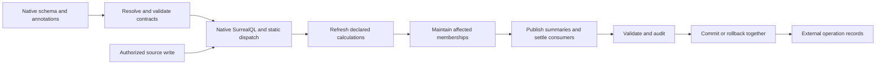

# Calculation foundation and compiler contract

Status: target design, updated 2026-09-26. Current behavior remains documented
in the [temporal contract](../../research/rebase/temporal-trees.md); foundation
packets C1–C4 now implement the typed-tree, compiler, reader, and audit contracts
below. Runtime and domain work remains open in the [plan](./plan.md). This
specification replaces the idea that the foundation is exclusively temporal or
accounting-specific.

## 1. Composition and ownership

A table defines record shape and native permissions. A tree family defines an
ordered projection and summary contract. A root field on one owner is a tree
instance. A source record contributes through a schema-declared membership
slot. These compose without creating a second identity for the business fact.

```text
record identity     = (namespace, database, table, record id)
tree instance       = (owner record, root field)
membership identity = (source record, slot field)
ordering key        = (ordered value, canonical record id, slot field)
```

Keys may change; membership identity does not. A source can join several tree
families or join one instance at several positions. `record.rb_start` is an
ordinary typed object containing one membership; `owner.rb_capacity` contains
the root. No runtime class registry or extra membership table is needed.

Four relations have different rules:

| Relation | Meaning | Integrity rule |
|---|---|---|
| Native reference | Identity, grouping, lifecycle, or an explicit parent. | Typed targets, access, existence, and delete policy. |
| Tree links | Search/balance topology and ordered navigation. | Reciprocal links, exact summaries, unique reachable membership, bounded height. |
| Calculation dependency | A consumed field or strictly earlier ordered summary. | Declared causality and same-transaction settlement; no feedback. |
| Reader source | A marked parent whose owner may read this child. | Direct parent ownership only; never inherited through tree links. |

Separate slot objects prevent structural interference, but slots on the same
SurrealDB record still share write conflicts and physical record rewrites.
Composition does not imply independent storage contention.



External operation processing starts from committed state. It is not part of
AVL maintenance or the synchronous calculation closure.

## 2. Root and membership contracts

Each root declares a homogeneous key type, a bounded summary shape, its
permitted membership slots, and a publication/read policy. Each node slot
names its allowed `table.root` targets explicitly. Both table and field must
match; independent global sets of tables and slots are insufficient.

Keep the existing `@rebase-tree-root`, `@rebase-tree-node`, and
`@rebase-tree-owner` vocabulary. C1 requires `@rebase-tree-key` on every root
and node and an explicit owner declaration on every node. It uses native value
names (`datetime`, `int`, later `decimal`). The earlier `temporal`/`ordinal`
spellings are rejected. Duplicate, unknown and incompatible contracts fail at
compilation; generated links enforce actual table/root-slot pairs.

The declaration syntax below is implemented. Its two-position interval behavior
still requires C2; current membership synchronization rejects different keys
from one source into the same owner root.

```surql
DEFINE FIELD rb_capacity ON resource_pool TYPE object
    COMMENT '@rebase-tree-root @rebase-tree-key datetime';
DEFINE TABLE reservation SCHEMAFULL
    COMMENT '@rebase-members fn::reservation::members @rebase-validate fn::reservation::validate';
DEFINE FIELD pool ON reservation TYPE record<resource_pool>
    REFERENCE ON DELETE REJECT COMMENT '@rebase-readers';
DEFINE FIELD rb_start ON reservation TYPE option<object>
    COMMENT '@rebase-tree-node @rebase-tree-key datetime @rebase-tree-owner resource_pool.rb_capacity';
DEFINE FIELD rb_end ON reservation TYPE option<object>
    COMMENT '@rebase-tree-node @rebase-tree-key datetime @rebase-tree-owner resource_pool.rb_capacity';
```

The native membership function emits start `+weight` and end `-weight`, with
`start < end`, positive weight, and the same owner. All structural fields,
owner revisions, and stored derived outputs reject client writes and forged
initial values. Top-level business references remain tracked; nested structural
links remain typed and untracked because native nested REFERENCE support is
not established in the current database version.

Rules for multiple positions:

- A `(source, slot)` occurs at most once. Two different slots may target the
  same owner at different primary keys.
- Coalescing groups by `(source, owner, primary key)`, not owner alone. The
  first schema-declared slot is the stable representative for coincident legs.
  Exact dimensions must agree; never use a hash to prove unit equality.
- Coalescing is for a domain projection that represents one net contribution.
  If independent occurrences at an identical key must count separately, use
  distinct source facts; do not silently change structural count semantics.
- Remove all obsolete positions using their cached old owner/key/value, then
  synchronize the new set, settle consumers, and validate the complete change.
  Removing one source may remove several mutually linked slots on that source.
- The owner revision is the write fence for a root invariant. Disjoint source
  writes competing for one last unit must conflict or reject, not both pass.

## 3. Ordering and read semantics

| Key type | Contract |
|---|---|
| `datetime` | Compare native instants without conversion through JS milliseconds; full timestamp precision. |
| `int` | Exact integer order in `[-9007199254740991, 9007199254740991]`. Guard before integer coercion on SurrealDB 3.2.0. Missing order omits membership, not rank zero. |
| `decimal` | Deferred until exact decimal transport, finite values, precision, and ties are verified. Never round through a JS Number implicitly. |

One tree never mixes key types or scale versions. Ordinal labels reference
immutable/versioned scale rows; their numeric codes express order, not a
quantity to average. A source can separately join a date tree and a score tree.

The full key gives deterministic ties. A short key `[value]` precedes all ties.
`before(key)` is strict, `range(lower, upper)` is half-open, `rank(key)` is the
1-based lower-bound insertion position, and `select(k)` is 1-based or NONE.
An amount percentile requires an amount-ordered family; it cannot be read from
a date-ordered family. Reject malformed bounds before comparison/coercion.

Public reads must preserve the root field's publication policy and native row/
field restrictions. A privileged cached summary can reveal hidden contributors;
requiring owner access alone is not a proof of confidentiality. Default guarded
trees use a common declared read scope. Publishing an aggregate more broadly
is an explicit policy, with a test, not an accidental effect of a helper.
The [compiled C1 fixture](../../dev-tools/temporal-tree/typed-fixture.surql)
demonstrates versioned stages, independent datetime/int trees, and both guarded
and deliberate aggregate publication. Scale and publication scope remain native
domain policies; the compiler does not infer them from a table name.

## 4. Summaries and validation

A summary operation needs an identity and associative ordered combine. It need
not be commutative or invertible. With fixed width `q`, each combine is O(q).
The first release keeps the existing bounded measure vector, count, extrema,
uniform tags, and optional datetime spans. Arbitrary client-supplied reducers,
unbounded sets/maps, and arbitrary comparator code are outside the contract.

```text
(A ⊕ B).sum        = A.sum + B.sum
(A ⊕ B).min_prefix = min(A.min_prefix, A.sum + B.min_prefix)
(A ⊕ B).max_prefix = max(A.max_prefix, A.sum + B.max_prefix)
```

Include the empty prefix in record-prefix extrema. Range summaries use ordered
subtree folds; subtracting prefix minima/maxima is incorrect. Dimensions bind
units and currency precision. A schema-owned projection function emits only
the declared measures; unknown measure names fail before storage.

For a complete-primary-key balance, maintain separate boundary extrema:

```text
internal candidates for A ⊕ B:
    A.boundaries
    A.sum + B.boundaries
    A.sum, only when A.last_primary < B.first_primary
whole minimum = min(0, sum, existing internal minima)
whole maximum = max(0, sum, existing internal maxima)
```

Absent internal boundaries stay absent, not zero. This prevents a rotation
from making an artificial deficit between a same-time release and acquisition.
The [accounting derivation](../all-in-accounting/blueprint.md#complete-timestamp-extrema)
gives the algebra and historical mathematical evidence. Keep record-prefix
extrema for strict causal formulas; use complete-key extrema for net financial
and half-open capacity guards. The policy is explicit in the domain validator.

Examples: stock floor uses minimum balance; `[start,end)` allocation uses
maximum load; changing capacity uses minimum residual supply; fixed rolling
windows add at `t` and release at `t + width`. Empty history starts at zero.
Rolling calendar months are not fixed durations: materialize calendar boundary
instants under a specified timezone/policy. Arbitrary quantiles, distinct sets,
and arbitrary changing windows do not become constant-width summaries by fiat.

A new summary algebra is a static library extension: define its shape,
identity/singleton/combine, independent scan oracle, and associativity tests
before a domain uses it. It is not a generic runtime plugin system.

## 5. Dependencies and complete writes

Parent fields, published roots, and earlier-prefix summaries are distinct
inputs. References alone do not imply recalculation. Infer direct field reads;
require `@rebase-depends` for reads hidden inside native helper functions.
Retain typed, top-level reference routes and field-sensitive invalidation.

Target settlement order:

1. Capture authoritative inputs and cached old memberships.
2. Evaluate local derived fields in a compiler-resolved topological order.
3. Reconcile any required output set through a source-owned recipe.
4. Repair affected positions and propagate ordinary changed-field consumers.
5. Drain strictly later prefix consumers in key order.
6. Publish all changed roots, refresh downstream published-summary consumers,
   and repeat the affected work until the acyclic closure is settled.
7. Validate the final affected sources/owners and append selected audit changes.
   Any failure rolls back the entire source operation.

A source edit cannot stop invalidation at an unchanged capped/rounded output.
Prefix sweeps currently cannot rekey/reparent their own contributors; retain
that restriction. A changed effective time from a parent or published input
uses an ordinary remove/reinsert path outside a sweep.

Whole-tree consumers must remain outside the input trees that determine them:
`input facts → input tree → tree-less basis → outputs`. Guards may inspect the
result; outputs must not feed their own whole-tree basis. Never interpret the
AVL parent or `prev` link as calculation ancestry. Initial non-temporal trees
support rank/select and summaries; ordinal-prefix reactive formulas require a
separate causality probe before enabling them.

**Local field names.** Removing alphabetical coupling requires correct CREATE
as well as UPDATE. Preferred lowering is a generated table-specific native
function with LET bindings in topological order. During initial VALUE
calculation, derive prerequisites from authoritative inputs rather than reading
not-yet-initialized stored shadows. Reuse the same resolved expression graph
for refresh; do not expand shared expressions exponentially. C3 verifies native
types, assertions, absence, field ACL, and nested-event behavior on CREATE and
refresh. The resolved dependency order removes the numbered-field requirement;
changing only the JS sort would have been insufficient.

**Required outputs.** Refreshing existing children does not create missing
children. A required recipe owns stable `(source, role)` output identities and
all of their lifecycle. Managed output tables deny client mutations. Their
private write adapters collect work for the outer source operation, rather
than invoking an independent final guard for each intermediate child. Ordinary
user-editable facts keep normal source events. No public `skip_validation`
flag, temporary client-writable readiness flag, or queue can implement this
boundary. C2 proves nested creation, replacement, deletion, duplicate retry,
partial failure, and direct child forgery before domain recipes rely on it.

Current events validate each source statement. A surrounding BEGIN/COMMIT does
not by itself make temporarily invalid intermediate statements legal.

## 6. Compiler and annotation contract

Use one fixed pipeline:

```text
load explicit materials → parse → resolve → validate → emit → verify artifacts
```

- **Load:** a JS profile lists framework files, domain modules, handlers, and
  optional final native SQL overrides. No filename-based hidden ignore dialect.
- **Parse:** build one source-located schema model; preserve native SQL clauses.
- **Resolve:** root/slot targets, field dependencies, ownership, exact audit
  projections, and operation contracts. No provider/domain behavior here.
- **Validate:** reject unknown/conflicting markers, unsupported types, malformed
  paths, illegal output patches, dependency cycles, and ambiguous definitions.
- **Emit:** small feature emitters consume the resolved immutable model. They
  do not rediscover or reinterpret annotations. Emit static SurrealQL dispatch
  and JSON/JS types for runtime boundaries.
- **Verify:** deterministic output, native SQL validity, exact handler coverage,
  and complete input/output traceability. Raw overrides remain explicit source;
  they require contract verification when they alter generated guarantees.

This is a small intermediate model and a fixed pipeline, not arbitrary compiler
plugins or hooks between every pass. Native SQL remains the escape hatch.
Resolve local field cycles statically; enforce data-dependent parent/root cycles
at mutation time. A cycle in table-reference types alone does not prove that
the actual record dependencies are cyclic.

| Surface | One supported meaning |
|---|---|
| Field `@rebase-audit` | Include that field's before/after values in an audit entry. No table-level marker or include/exclude/redact variants. |
| Field `@rebase-change-log` | Record that the field changed, with actor/target/time, without either value. Mutually exclusive with value audit on the same field. |
| Field `@rebase-readers` | Inherit direct referenced parents' owners for reads. No implicit inheritance from unmarked references. |
| Native `REFERENCE ...` | Existence/delete relation; retain generated permission-sensitive reference checks. No redundant reference annotation. |
| Field `@rebase-derived`, `@rebase-depends` | Protected calculation output and declared opaque consumed paths. |
| Tree root/node/key/owner annotations | Explicit structural membership contracts described above. |
| Table `@rebase-members`, `@rebase-validate` | Native projection and final guard functions. |
| Table `@rebase-operation ...`, field input/output markers | [External operation contract](./operations.md); independent of calculation dependencies. |

Unknown old markers produce migration diagnostics, not silent fallbacks. Value
and value-free audit projections share one event/envelope/storage path. Tables
without marked fields emit no event. A selected table retains CREATE/DELETE
lifecycle events when an optional selected leaf is absent; UPDATE logs only
selected-field changes. Technical tree/lease/refresh fields are excluded
structurally. Append audit after successful calculation settlement in the same
transaction; a failure to persist required audit rolls the write back. Audit
read policies must not expose a private source field through a public log.

Field selection must preserve concrete nested leaf paths, not silently discard
annotations below the top level. Build those paths into the resolved model;
audit only the selected leaves. Reject overlapping/container selections and
unsupported wildcard annotations with a diagnostic instead of copying an
entire object containing unmarked secrets. Add a nested public/private-field
fixture to C3/C4. Native reference dependency routes remain top-level where the
database's tracked-reference contract requires it.

## 7. Identity, readers, and configuration

Framework principals are `rebase_user` and `rebase_group`; the root is
`rebase_group:root`. These fixed names replace principal discovery/rebinding.
Framework definitions own their native privacy policies. Remove
`@rebase-internal` and `@rebase-authentication-private`; `PERMISSIONS` and the
explicit material ownership boundary express the policy.

For marked direct parent references:

```text
readers_index(child) = distinct(non-NONE parent.owned_by values)
```

Do not copy `parent.readers_index` and do not walk ancestors or tree links.
A parent's owner change refreshes its marked children. A child's parent edit
refreshes that child's index. A mere index change does not fan out again.
Missing parents are rejected by the native reference contract or contribute
nothing for an optional absent reference. Typed bounded reference arrays may
participate only when explicitly marked and covered by the same tests.

The owner rule already covers the child's owner. Reader permission tests
intersection with the caller's authorized user/group principals, not only a
literal user ID. `selectPolicy: 'readers' | 'owner'` is the single profile
choice; both compute the same reader index. This policy never grants writes.
Authorization group ancestry is a separate existing graph and remains intact.

Provider credentials live in protected typed rows, including recovery delivery.
A small JS configuration supplies only process wiring, endpoints, bootstrap DB
credentials, internal transport authentication, and bounded runtime settings.
Use Node's environment support; remove the custom .env grammar and layered
fallback chains. See operations for the unauthenticated recovery boundary.

## 8. Repository and developer workflow

Target responsibility layout (move after behavior passes, not as a substitute
for fixing it):

```text
rebase.config.js                     explicit JS profile composition
src/compiler/                       public compile API, passes, feature emitters
src/calculation/                     shared tree and dependency SurrealQL
framework/                          identity, access, audit, operation contracts
runtime/                            Node HTTP, runner, store, queue, reconciler
runtime/adapters/                    provider-specific protocols and signatures
designs/<module>/                   native schema, functions, handlers, fixtures
designs/rebase-system/              this design and acceptance record
dev-tools/                         small JS build/deploy/fixture entrypoints
dev-tools/probes/                   compiler, calculation, runtime, applications
dev-tools/research/                 bounded disposable experiments
build/<profile>/                   reproducible generated artifacts
```

Expose the existing compilation machinery as `compile(profile)` and
`writeArtifacts(result)`. Keep compilation free of network/deployment work.
`deploy(connection, artifacts)` and `populate(connection, fixture)` are separate
explicit JS calls. A short `node dev-tools/build.js` reads the chosen profile;
no parallel CLI/config precedence system is needed. Do not commit credentials
or load application configuration in research probes.

Return artifacts and diagnostics rather than printing inside compiler passes.
Diagnostics name source file/line, field, violated contract, and correction.
Generate JSDoc/declaration types for handler authors and runtime input/patch
validation. Separate small functions are useful, but only checked input/output
contracts establish type safety.
