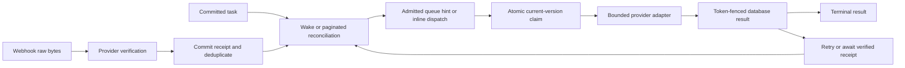

# External operations, scheduling, and adapters

Status: O1 implementation and O2a-O2s checkpoints, 2026-09-26. This replaces the
three-lane/repeating-schedule proposal. `gateway/` uses a native `node:http`
listener (O1a) and Node's native `--env-file` loading (O1b). O1c2a emits mode-specific
events, and O1c2b adds production internal-event bearer authentication plus a
typed BYOC recovery policy. Challenge hashes and encrypted queued delivery
tasks commit atomically; a static worker validates live revisions, expiry, and
nonce before calling Brevo or Twilio.
O1c3 resolves one immutable process profile and rejects malformed settings or
CLI/API config overrides. Compiler, server, workbench, and populate share this
profile contract; workbench/populate can select only configured contexts.
Grant adapters are currently allowlisted to S3 signed upload/download grants.
O2a adds private execution/revision identities, versioned operation envelopes,
token/identity/revision-fenced store transitions, and execution-scoped email
idempotency keys. The Brevo adapter sends its execution UUID in the documented
JSON `headers.idempotencyKey` field; Brevo's [idempotency contract](https://developers.brevo.com/docs/heterogenous-versions-batch-emails)
specifies a 30-minute deduplication window. A repeated key returns
`duplicate_parameter`; provider status is recovered through a unique execution
tag and the transactional event report, not by looking up the idempotency key.
The event report is bounded to 90 days. A matching recipient/tag event with a
message ID confirms provider acceptance; an empty result remains ambiguous and
is polled again because it cannot prove that no send occurred. Authentication
email tasks use this same read path. Twilio still has no provider-specific
reconciliation contract.
O2b gives async, inline, and queued tasks one-shot
`execute_at` eligibility, positive priority, edit-revision events, database
attempt/retry state, one BullMQ operations queue and a separate dead-letter
queue, a five-minute admission horizon, and bounded keyset reconciliation. The
SQS and recurring-schedule paths are removed. O2c runtime probes verify delayed
eligibility, rescheduling, capacity reserve/recovery, active cancellation
outcomes, bounded-page wrap after a newly backdated row, and lease reclaim after
a simulated crash before handler start, and re-admission after capacity returns.
O2d emits a bounded repeat-safe legacy backfill and guarded finalizer; a
disposable old-schema probe verifies next-time preservation and active-lease
quarantine, now across 2,005 rows in three 1,000-row-bounded passes (O2m).
O2e verifies hint recovery after an isolated Redis restart and a
fresh runtime instance. O2f serializes bounded admission between independent
BullMQ clients sharing Redis and a queue prefix. O2g records provider start
under the live lease and moves expired started attempts to `ambiguous` before
they can run again. O2h persists per-database reconciliation cursors, finite
per-table sweep bounds, and round-robin position with versioned compare-and-set
updates. Production migration execution and provider-specific reconciliation
contracts remain open. O3
durable provider receipts remain separate. See O1–O3 in the
[plan](./plan.md) and measured scope in [verification](./verification.md).

## 1. Execution boundaries

A database transaction cannot undo an email, charge, upload, or provider order.
Keep calculation facts separate from records requesting those actions. Use
three concrete contracts rather than hiding that distinction inside a handler:

| `@rebase-operation` mode | Behavior | Permitted trigger |
|---|---|---|
| `grant` | Synchronous stateless signing or read-only provider work. A database event may request a bounded response; no irreversible provider mutation. | Explicit CREATE and/or UPDATE. |
| `inline` | Execute a **committed** durable task immediately through the same claim/finish path as queued work; no Redis round trip required. | CREATE of a task record. |
| `queued` | Execute a committed durable task through a replaceable BullMQ wakeup, at or after its declared time. | CREATE of a task record. |

Illustrative target syntax:

```surql
DEFINE TABLE send_email SCHEMAFULL
    COMMENT '@rebase-operation queued CREATE @rebase-adapter sendEmailV1';
DEFINE FIELD configuration ON send_email TYPE record<email_configuration>
    REFERENCE ON DELETE REJECT READONLY COMMENT '@rebase-operation-input';
DEFINE FIELD recipient ON send_email TYPE string READONLY COMMENT '@rebase-operation-input';
DEFINE FIELD provider_id ON send_email TYPE option<string>
    PERMISSIONS FOR select WHERE true FOR create, update NONE
    COMMENT '@rebase-operation-output';
```

No separate `@rebase-events` declaration duplicates the mode's CRUD contract.
`inline` and `queued` share the same durable task schema and handler signature;
only initial dispatch differs. A stateful fast response uses `inline` after
commit, not a provider call inside an uncommitted SurrealDB event. If the HTTP
wait expires, the task and its outcome still exist and can be queried/recovered.
Recovering an interrupted inline task may use the same worker/reconciler.

Current transitional handler exports are static per table. A grant table exports
`grant: { CREATE, UPDATE }`; an inline or queued task table exports `execute()`.
The compiler derives the mode, events, timeout, input references, adapters, and
output patch allowlist from schema comments. A grant declaration may name only
the built-in S3 signing adapters. Inline/queued timeouts persist an ambiguous
outcome instead of blindly resubmitting an external write. These operation
contracts compile and run, but their current task fields are a bridge to the O2
task schema, not its final revision/phase contract.

A file/object deletion is an explicit cleanup task. Deleting an entity cannot
leave only a queue message naming a nonexistent row. Create the cleanup intent
with the required immutable provider identifiers before removing the entity,
in the same database operation. The test attachment fixture implements this
with a synchronous `DEFINE EVENT` that inserts a private queued cleanup task;
the generated asynchronous task event only publishes its wake after that
request is durable. SurrealDB runs synchronous event statements in the source
transaction and bypasses record-user permission checks inside the event
([event semantics](https://surrealdb.com/docs/reference/query-language/statements/define/event)).
The probe verifies that a rejected task insert rolls back the source delete
and that a record user cannot create cleanup work directly. This is an
application-authored SurrealQL recipe today; the compiler does not infer
cleanup tasks for arbitrary tables. A task's own DELETE means
cancellation/retention cleanup, not an implicit provider DELETE call.

Cleanup tasks retain the configuration reference and immutable provider key
after the source row is gone. Attachment object keys are random per creation,
so deleting and recreating the same record ID cannot make old cleanup target a
new object. Cleanup is delayed until the last stored signed-access grant expires,
plus five seconds, so a still-valid upload URL cannot recreate the object after
cleanup. The queued handler calls `purgeS3Object` under the live task lease
marker. The adapter enumerates object versions and delete markers for the exact
key, removes version IDs in batches of at most 1,000, and starts listing again
after each successful batch. A retry therefore discovers remaining versions
after a partial response or process loss. The fake adapter probe covers 1,003
versions/delete markers, a neighboring prefix key, and bounded delete batches;
runtime probes cover response loss and pre-apply failure. No live bucket is
used. Versioned buckets require `s3:ListBucketVersions` and
`s3:DeleteObjectVersion`; key-only deletion can add a marker while retaining
older versions ([ListObjectVersions](https://docs.aws.amazon.com/AmazonS3/latest/API/API_ListObjectVersions.html),
[DeleteObjects](https://docs.aws.amazon.com/AmazonS3/latest/API/API_DeleteObjects.html),
[DeleteObject](https://docs.aws.amazon.com/AmazonS3/latest/API/API_DeleteObject.html)).
MFA Delete, Object Lock/legal holds, and S3-compatible providers without these
version APIs need a provider-specific policy.

Business `effective_at`, claim `due_at`, and task `execute_at` are unrelated
contracts. A future-dated stock posting is not proof that a machine executed.

## 2. Durable task state

Every task has `execute_at`, defaulted by the database to now, even for an
immediate task. One record requests one action once. Repeat behavior is explicit
creation of additional records; remove cron expressions, occurrence counters,
catch-up loops, timezone recurrence parsers, and repeat-job schedulers.

Persist only authoritative lifecycle information:

| Field | Owner and meaning |
|---|---|
| `id`, namespace/database | Native context and record identity. |
| `execution_id` | Private immutable UUID for this provider action; different after deleting/recreating the same record ID. |
| `revision` | Private fresh version token after an accepted input, time, priority, or phase change. Reject stale wakeups and stale completions. |
| `execute_at` | User-specified earliest start, mutable only before claim. |
| `priority` | Normal task urgency, integer 10–100, default 50. |
| `phase` | `ready`, `waiting`, `uncertain`, `succeeded`, `failed`, or `cancelled`. |
| `attempt`, `retry_at` | Database-owned retry budget and earliest retry/poll. |
| `lease_token`, `lease_until` | In-flight claim, separate from business phase. No duplicate stored running flag. |
| `rebase_provider_started_at` | Private write-ahead marker committed under the lease before a side-effecting adapter is called. An expired lease with this marker is ambiguous and cannot re-enter normal execution. |
| `cancel_requested` | Intent to prevent further action; not proof an in-flight action was undone. |
| Provider outputs and error | Typed allowlisted results; provider correlation and sanitized error details. |

`waiting` means the provider accepted an action and completion is pending.
`uncertain` means submission/completion is unknown and automatic resubmission
is unsafe until reconciled. Lease validity is the derived running status.
Ready may represent first execution or a known-safe retry; no separate
scheduled or retrying lifecycle is needed.

Terminal operation records remain queryable for 30 days by default, configured
with `REBASE_TERMINAL_TASK_RETENTION_DAYS` (1–3,650 days). Reconciliation
deletes at most one bounded page per pass. It may remove confirmed
`succeeded`, `failed`, and `partial` outcomes, plus cancellations that never
started provider work. It never removes `ambiguous` work, an active lease, or a
record with an unresolved provider-start marker. Cancellation receives a
private timestamp so its retention age is measured from the request. Callers
that need longer history must copy the outcome into their durable business
record before the operation row expires. This does not define retention for
audit events or webhook receipts; those have separate policies.

Inputs, `execute_at`, and priority become immutable at the first claim. An
accepted pending edit gets a new revision and wakes with the edited due time.
Once started, a new business request requires a new execution record. Provider
idempotency keys derive from immutable execution identity and a stable action
slot, not the changing lease/revision/attempt. The current single-send email
task uses its execution UUID directly.
Pin the provider account/configuration identity for that execution. Credential
rotation may retain that account identity; changing the merchant/account itself
requires a new configuration version rather than redirecting a retry elsewhere.
Every side-effecting adapter must be listed in `SIDE_EFFECT_ADAPTERS`; the
runtime writes `rebase_provider_started_at` immediately before invoking one,
only while the lease is live and cancellation has not been requested. A
cancellation that wins before this marker suppresses the provider call.

### Existing-database upgrade

The compiler emits `migrate-one-shot-backfill.surql` and
`migrate-one-shot-finalize.surql` next to each generated schema. These are
upgrade-only artifacts. Stop and drain the old gateway workers, apply the new
`schema.surql`, run the backfill file, and repeat it until every task table
reports `processed: 0`. Then run the finalizer and start the new gateway. The
compiler CLI writes the generated backfill and finalizer into the selected
build directory; verify that both files are nonempty and pass `surreal validate`
before applying them. The build check compares them to the current compiler
output. The backfill updates at most 1,000 rows per task table per run and
preserves existing execution IDs, revisions, times, priorities, outcomes, and
retry times. Legacy
recurring rows become one-shot work at their stored next occurrence, or now if
no next occurrence was stored; repeat settings are removed. A legacy row with a
lease but no recorded outcome becomes `ambiguous`, has its lease cleared, and
requires provider reconciliation before any safe retry. Resolve those rows
manually when their handler has no reconciliation method. The finalizer checks
all task tables before removing the old schedule fields and index. Do not run
these files on a fresh installation or while a gateway worker can still own an
old lease.

Use `npm run build` (or `npm run build:all-in-one`) to emit the migration
artifacts, then run `npm run check` (or `npm run check:all-in-one` for that
profile) and native `surreal validate` on both files before the maintenance
window. The bounded runner can apply them with:

```sh
node --env-file=.env dev-tools/lifecycle-migration.js --profile test --apply \
  --confirm-workers-stopped --confirm-backup-created
```

Add `--context namespace/database` only when selecting one context from the
profile's allowlist and `--max-passes N` to bound each invocation. If the limit
is reached, it exits without finalizing; rerun after reviewing the reported
per-table counts. The runner never stops workers, creates backups, or verifies
those acknowledgements externally. Keep the deployment window open until the
finalizer and new gateway startup both succeed.

## 3. One context convention, typed messages

Canonical locator:

```js
{ namespace: "tenant", database: "app", id: "send_email:abc" }
```

A record ID is not globally unique across contexts. Queue jobs carry only a
validated envelope such as:

```js
{ version: 1, kind: "operation", locator, executionId, revision }
{ version: 1, kind: "receipt", locator: receiptLocator, revision }
```

Use a discriminated union, not one object filled with NONE fields that have
no meaning for a particular operation. Event, phase, due time, priority, and
credentials are loaded from the trusted contract/current row. A message does
not authorize a transition by claiming a new status or priority.

Queue ID: `w-` plus a SHA-256 base64url encoding of the canonical context,
kind, execution identity, and revision tuple. The prefix prevents collision
with BullMQ's own Redis key names, and the encoding avoids forbidden `:`
characters. Check the loaded full tuple before work; a transport ID is neither
an authorization token nor a business uniqueness proof. Finished-job retention
is not a deduplication guarantee.

For providers with short metadata limits, persist a unique opaque correlation
ID mapped to the full context, execution, and configured provider account.
Enforce uniqueness in storage and resolve/verify it on receipt. Do not truncate
a record ID or assume an unsigned client-supplied namespace is trustworthy.

## 4. One queue, due time, and priority

Use one BullMQ queue for eligible operation hints and verified receipt hints.
Remove the SQS branch and the schedule/webhook queue drivers in the breaking
cutover. Keep ordinary adapter functions; do not retain a transport abstraction
whose only purpose is a retired driver.

- BullMQ's smaller **positive** number is more urgent. Use 1 for receipt
  application, 10–100 for ordinary tasks, default 50; never enqueue priority 0.
  Priority classification comes from trusted runtime code, not webhook JSON.
- Time controls eligibility; priority orders eligible jobs. Future urgent work
  cannot run early. Priority does not preempt an active provider call and does
  not guarantee fairness or exact execution time.
- Jobs due within a bounded horizon can use `delay = max(0, due - now)`.
  Far-future tasks remain only in SurrealDB. The worker rechecks database time,
  phase, revision, and cancellation during the atomic claim.
- Adding the same BullMQ job ID does not replace its body or priority. New
  revisions get new job IDs; stale jobs acknowledge without a provider call.
- Removing an absent job is successful. Removing a locked active job can fail;
  database cancellation/fencing remains authoritative.

Initial development limits, **configuration defaults to validate, not capacity
claims**: 1,000 live hints, 100 reserved for receipts, a five-minute horizon,
100 records per reconciliation and retention page, and bounded worker concurrency. Count
waiting/paused, prioritized, delayed, and active jobs. Bound completed/failed
retention and the event stream separately; a live-job count is not a RAM limit.

All publishers sharing the Redis deployment and BullMQ prefix use the same
token-owned admission lease. It serializes the live-count check and enqueue;
the owner renews the lease while checking capacity and confirms ownership just
before adding the hint. HTTP wakes and reconciliation share this path, and
workers can consume concurrently. At capacity, drop only the hint and retain
the committed database record. Redis uses `noeviction`; enqueue failure also
leaves work recoverable. A concurrent two-client probe verified the configured
cap and receipt reserve. A process pause longer than the lease can still allow
the lease to expire before enqueue completes, so production restart/pause
behavior and admission metrics remain release gates.

Avoid strict-priority starvation by bounding admitted receipt work and measuring
oldest-ready age per class/context. The first release promises urgency and
recoverability, not a universal latency bound. If that bound is required, the
verification gate must demonstrate an admission/service quota before release.

## 5. Claim, execute, and recover



The claim is a conditional database update checking execution/revision, a
nonterminal allowed phase, `execute_at <= database now`, retry eligibility,
no cancellation, and an absent/expired lease. The worker uses a fresh token.
Only a result with the same token, revision, execution, and expected phase may
commit a patch. Lease renewal and completion also use conditional updates.
Keep output field allowlists and native field types; handlers cannot patch an
owner, credential, membership, task identity, or another task's state.

Retries/backoff and the retry budget live in SurrealDB. BullMQ can redeliver
hints, but does not own a second authoritative attempt policy. Do not recurse
into another handler inline after a state change: persist the transition and
schedule its next step. Bound step duration and observe cancellation through
an AbortSignal; timeout is not proof the provider stopped.

| Failure/race | Required result |
|---|---|
| Database commit succeeds, wake is lost or Redis is down/full | Paginated reconciliation rediscovers the due row. |
| Wake arrives before its source transaction is visible | Ignore/retry the hint; committed-state reconciliation is the recovery guarantee. |
| Duplicate delivery or two workers claim together | At most one valid database lease; losers do no provider work. |
| Process dies before provider submission | With no provider-start marker, an expired lease permits normal recovery. |
| Process dies after provider start but before outcome commit | The next claim rotates the revision, records `ambiguous`, and does not call the handler again. Reconciliation or provider idempotency is required before retry. |
| Provider succeeds, result commit/response is lost | Query/reconcile or retry with the same provider idempotency key inside its documented retention window. Without either capability, enter uncertain; do not claim exactly-once delivery. |
| Old worker finishes after lease replacement or rescheduling | Its conditional completion fails. A provider call already made is reconciled, not erased. |
| User deletes a pending, unclaimed task | Missing task makes stale hints no-ops. |
| Cancellation races with an active provider call | Record cancellation intent, reconcile the result, and create compensation only when the provider/domain supports it. Retain the execution record. |
| Terminal task ID is reused | New execution identity prevents old hints/receipts from acting on the replacement. |
| A due row permanently fails | Persist failed/uncertain state and diagnostics; do not depend only on a Redis dead-letter copy. |

Reconcile all configured contexts and operation tables using indexes and
keyset pages, not unbounded SELECT/array flattening or OFFSET scans. Scan ready
work, due polls, and expired leases in bounded turns. Advance cursors even when
a page contains rejected/capped entries; cycle contexts/classes fairly and
restart a completed scan so newly backdated rows are not lost. Protect time
and memory budgets. New input does not require scanning months of far-future
schedules into Redis. Alert on oldest eligible age, expired leases, uncertain
outcomes, dropped hints, backlog, and per-context service lag.

The applied framework schema defines the private
`rebase_reconciliation_cursor` singleton. Each database stores the per-table
keyset cursor and high-water record ID for the active sweep, plus the table
rotation offset and CAS version. Runtime saves the advanced page before
publishing queue hints; capacity-rejected rows are revisited on a later sweep.
The high-water bound lets a sweep finish while new records arrive, then the
next sweep starts at the beginning so rows inserted behind an earlier cursor
are found. CAS conflicts retry from stored state and defer after bounded
contention rather than overwriting another runtime's progress.

## 6. Webhooks are durable input

1. Enforce raw-body size/time limits before parsing.
2. Select a statically registered adapter by route; extract only enough
   untrusted correlation data to resolve the configured provider account.
3. Verify the provider protocol over the exact raw bytes with that account's
   secret, including timestamp/replay rules where the protocol supplies them.
4. Commit a private normalized receipt with provider-account/event uniqueness,
   target execution, relevant typed payload, and body hash. Repeated event IDs
   must not substitute conflicting payloads.
5. Acknowledge only after durable acceptance or recognition of an existing
   receipt. If durable storage fails, return a retryable failure.
6. Enqueue a high-priority receipt hint if capacity permits. Otherwise let
   reconciliation apply the already committed receipt.

Receipt application and target transition are conditional and atomic. A late,
duplicated, or out-of-order event cannot regress a terminal state or apply twice.
Provider-specific completion facts may require separate typed transitions;
an old event does not automatically overwrite newer information. Keep receipt
retention long enough for the provider's replay/reconciliation contract.

A webhook is not a database event with a different priority. It crosses an
external authentication and durability boundary before entering the same queue.

## 7. Static typed handlers

Resolve table and allowed phase from the current database row and compiled
contract. The profile explicitly wires handler exports and named adapters.
Separate functions per reachable phase give short implementations:

```js
module.exports = {
  table: "send_email",
  steps: { ready: submitEmail, waiting: checkDelivery, uncertain: resolveSubmission },
  receipts: { delivered: applyDelivery, rejected: applyRejection },
};
```

The compiler/build checker rejects missing reachable steps, unknown phases,
undeclared adapter use, invalid patches, and duplicate table registration.
Terminal phases have no execution handler. A result is a checked union of
success, retry-at, waiting, uncertain, or permanent failure, with allowed
output fields. JSDoc/declaration types improve editing; runtime validation and
native database types still enforce external input boundaries.

Provider-specific URLs, protocols, HMAC algorithms, and versioned functions are
ordinary imperative adapter code. Secrets are resolved from typed configuration
rows. A function name can contain a version; clients never supply arbitrary
function names, file paths, SQL, or provider endpoints to the dispatcher.

## 8. Credentials, HTTP, and developer setup

Use `node:http` for a small route table, streaming body limit, request deadline,
AbortSignal propagation, error mapping, readiness, and graceful worker drain.
Do not rebuild a general web framework. Preserve exact webhook bytes.

Internal grant/wake endpoints require configured service authentication and
allowlisted database contexts. A private URL, DNS allowlist, or native reference
assertion is not authentication for a privileged Node endpoint. Keep the
existing shared-secret capability unless an enforced authenticated private
transport replaces it. Native existence checks under record-user scope remain
useful at source-write time; root/service connections do not inherit that scope.

An inline execution endpoint operates on a committed task and verifies the
caller's record token/context. Return only fields visible through a user-scoped
read, not the privileged handler patch. No arbitrary root query endpoint.

Provider configuration uses typed records for both tenant BYOC and platform
email/SMS delivery. Developers can provision a shared record owned by
`rebase_group:root` and authorize clients to reference/use it without exposing
its secret. Email and phone/SMS credential families must be reusable by auth
and ordinary application operations. Defaults, population, and binding are
developer/deployment work; the core does not provision them. `rebase_group:root`
is a record principal group, not a SurrealDB system root login. The current
native-private credential tables still need the K4 ownership/use work in the
[core handoff](./core-handoff.md).
Secrets have read restrictions **and** controlled create/update permissions,
and use value-free change logging if needed. Keep tenant secrets out of process
configuration, audit payloads, and generated artifacts.

Every anonymous action needs a narrow trusted entry boundary because direct
client table access requires authentication. For recovery, the requester
cannot choose a privileged credential row or arbitrary recipient. Resolve the
existing identity and its pre-provisioned delivery policy, rate-limit by caller
and identity, return a uniform response, and create a bounded challenge-delivery
task. Preserve expiry, attempt limits, single-use redemption, address revision
fencing, and stateless allowlisted OAuth. Recovery is not an account-creation or
namespace-provisioning route.

The current implementation fixes the policy at
`rebase_authentication_delivery_policy:default`. It writes the challenge hash,
revision fence, nonce, and encrypted queued delivery task in one transaction.
The worker rechecks live principal/identity revisions, challenge expiry,
single-use state, and nonce before decrypting the message. Production requires
a stable `REBASE_AUTHENTICATION_PAYLOAD_SECRET` of at least 32 bytes, separate
from the runtime event-authentication secret.

The validated process profile contains the Node listener, SurrealDB bootstrap
connection, Redis settings, configured contexts, internal authentication, and
runtime limits. Node loads environment files before startup, and each
entrypoint injects one immutable configuration object. Platform Resend/Twilio
variables and process credentials are removed. The O2b source cutover removed
SQS URLs and the direct cron-parser dependency. Both generated schemas now
validate, the generated migration artifacts pass native validation, and the
targeted O2c/O2h/O2i/O2j/O2k/O2n/O2o runtime gates pass. A production
existing-row rollout, provider-specific reconciliation, and O3 receipt
durability still require verification. O2e covers Redis restart and runtime reinitialization;
O2f covers shared Redis admission coordination with separate clients; O2g
covers simulated lease loss after provider start; O2h covers persisted cursor
recovery across runtime instances; O2i covers cleanup request persistence and
response recovery; O2j covers worker-process death and receipt-based recovery
against a fake provider ledger; O2k covers gateway-process plus Redis restart
with durable cursor recovery; O2l aligns Brevo idempotency with its documented
UUID/body-field contract; O2n adds exact-key versioned S3 purge and retry-safe
batching; O2o adds bounded terminal-task retention; O2p verifies migration
resume after a file-backed database restart. O1a
removed Hono and its Node adapter after the listener migration passed the
runtime probe.

All provider tests use a temporary localhost HTTP server. It must emulate signed
receipts, retries, timeouts, duplicate/out-of-order events, and success followed
by a lost response. It must never call live email/payment/storage accounts.
