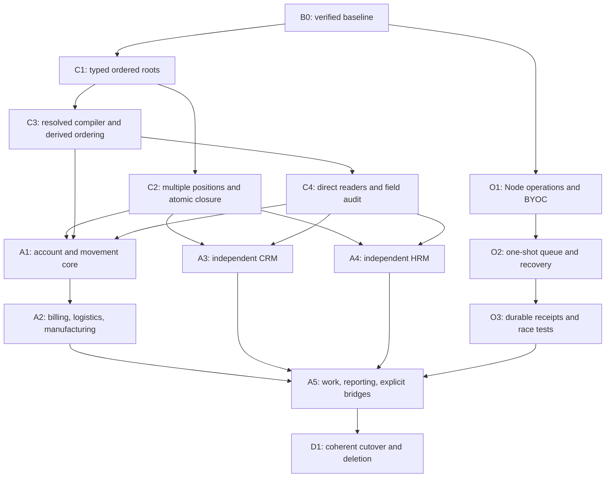

# ReBase redesign implementation plan

## Current execution authority — 2026-09-29

Use [core-handoff.md](./core-handoff.md) for core implementation: **K1–K5
passed** on the recorded dirty snapshot. H1/H2/H3a/H3b passed for the revised
target profile; H3c's bounded fixture, H4a, H4b1, H4b2, H4b3, H4b4a
payer-side supplier withholding, H4b4b customer-withheld TDS, and H4b5a paired
claim offset and H4b5b treasury-backed remittance passed their scoped gates;
see [H4b5b evidence](./evidence/2026-09-29-h4b5b-tax-remittance.json).
H4b5c residual policy remains future and unresolved. H5a's complete-timestamp
stock floor, H5b physical return with dated source capacity, and H5c standalone
receivable cash refund passed. H6a ordered resource-pair identity and entered-
quantity currency exchange passed; H6b quote-derived currency exchange also
passed. H7 immediate assembly passed its bounded schema/probe and regression
gates; see [H7 implementation evidence](./evidence/2026-09-29-h7-immediate-assembly.json)
and separate [gross-input feasibility evidence](./evidence/2026-09-29-h7-gross-input-feasibility.json).
H8 bounded timed production passed its integration and scoped regression gates;
see [H8 integration evidence](./evidence/2026-09-29-h8-timed-production-integration.json).
The bounded implementation gates through H8 have passing evidence. H8 physical
cost measurement remains open, and H4b5c residual policy requires a concrete
business policy. H0 context compression remains a separate maintenance packet.
No new domain expansion is assigned. See the accounting handoff for packet
scope and remaining verification work.
See the H4b5a evidence and the H4b3 evidence in the
accounting/logistics/exchange/basic-assembly handoff. Its
[new handoff](../all-in-accounting/implementation-handoff.md) owns H0–H8; CRM/HRM
remain future scope. The [audit](./core-audit.md) contains dated
checks, the reproduced and subsequently fixed admission race, verified
credential boundaries, and corrected identity requirements;
[configuration](./core-configuration.md) gives exact settings.
The roadmap and packet history below are retained for reference, not as a
claim of full reliability; the packet authority remains in the accounting
handoff.

## Historical implementation status before the core audit

Recorded status: architecture/design pass and foundation packets C1, C2a-d, and C3-C4
complete; O1a native HTTP, O1b native environment loading, O1c1 operation
contracts, O1c2a mode dispatch, O1c2b production event auth/BYOC recovery,
O1c3 strict process configuration, O2a execution identity fencing, O2b
one-shot source cutover, the targeted O2c runtime slice, O2d migration
artifacts, O2e Redis recovery, O2f shared admission coordination, O2g
provider-start recovery, O2h durable reconciliation cursors, O2i durable
entity cleanup, O2j process-death recovery, O2k gateway restart recovery, and
O2l Brevo idempotency contract correction, O2m multi-batch migration, O2n
versioned S3 cleanup, O2o terminal-task retention, O2p file-backed migration
restart recovery, O2q Brevo event reconciliation, O2r migration artifact
emission, and O2s bounded migration runner verified. O3a durable receipt
acceptance/worker application, O3b queue-outage/commit-failure boundaries,
O3c Razorpay paid/refunded phase ordering, O3d provider/context routing guards,
O3e receipt commit-response-loss recovery, O3f stale receipt lease fencing,
O3g bounded Redis receipt admission/recovery, and O3h persistent receipt
recovery after queue saturation, O3i persistent receipt recovery through a
Redis outage, O3j Razorpay payment-snapshot phase guards, O3k Razorpay
config-bound webhook routing, and O3l Razorpay processed-refund snapshots
verified, 2026-09-26. Accounting packet A1 (identity/dimensions, movements/FX,
standalone claims, and dated openings) now passes its compiled/native-validated
probe gate. A2a-A2d signed adjustments, cash allocations, issue-date invoice
pricing, and required invoice-line lifecycle are implemented and probed; tax,
refunds, offsets, paired recipes, and the remaining A2 work remain open.
O2 production
migration/recovery gates, remaining O3 failure/race gates, and the proposed
application suites remain implementation work. Current check results are in
[verification](./verification.md), not inferred from this roadmap.

This replaces the earlier domain-only phase list. Historical integer checkpoint
1a remains recorded in [ordinal feasibility](./ordinal-feasibility.md); the
formerly unfinished 1b/1c work is covered by C1 below. Existing uncommitted work
has been preserved; completion is supported by the executable checks.

## 1. Outcome and source of truth

Deliver a native SurrealDB calculation foundation that composes typed records,
ordered memberships, bounded summaries, and declared dependencies; a small
Node operation runner; and independent domain modules built from those contracts.

| Document | Owns |
|---|---|
| [Review](./review.md) | Source precedence, requirement IDs, corrections, current-code findings. |
| [Foundation](./foundation.md) | Identities, keys, membership, summaries, dependencies, compiler/ACL/audit/JS authoring contract. |
| [Operations](./operations.md) | External execution, one-shot scheduling, queue admission, durable recovery, BYOC, HTTP and handler contract. |
| [Domain blueprint](./blueprint.md) | Shared invariant-first application recipe and integration boundaries. |
| [Applications](./applications.md) | Accounting, logistics/manufacturing, CRM, HRM, work/reporting contracts and acceptance cases. |
| [Tree catalog](./tree-catalog.md) | Current source inventory and proposed family budget. |
| [Verification](./verification.md) | Measured checks, algorithm decision, evidence limitations, and future test matrix. |

No generated profile is called complete merely because its schema parses.
No capability is marked implemented until its own exit conditions pass.

## 2. Dependency order

Independent work packets may be developed separately; no dependent feature
bypasses an open gate. This graph is an implementation dependency graph, not a
request to run extra agents. Implement one reviewable behavior change at a time.

## 3. Work packets and acceptance

### B0 — Baseline and design (this pass)

Read the complete attachment, current architecture and schemas, focused compiler/
runtime code, and pending tree work. Record the 22 source root declarations in
all-in-one, the current versions, known limitations, and uncommitted files.
Run focused compiler/ordinal checks, current temporal regression, deterministic
compilation/native validation, and bounded function/queue experiments. Preserve
the original attachment and existing source edits.

Exit: reviewed requirements and designs with links to actual evidence. This
closes the planning deliverable, not any proposed implementation gate.

### C1 — Typed ordered roots

**Complete.** `src/tree-contract.js` and `src/generators/tree.js` implement the
explicit `datetime`/`int` key and finite owner contract. All existing tree
schemas are migrated. `npm run probe:typed-tree` compiles the versioned-stage
fixture and checks it against an independent source reconstruction. Exact
link assertions are grouped by table to avoid the computation-depth failure
found in the accounting regression. See [verification](./verification.md).

1. Make key type and finite owner targets mandatory for all memberships in the
   breaking contract. Generate valid table/slot pair checks, not Cartesian
   unions. Reject unknown/duplicate/incompatible declarations before emission.
2. Separate order comparison/key validation from temporal spans, timestamp
   guards, and prefix scheduling. Retain the shared AVL mutations.
3. Carry guarded integer input through stored keys and public query bounds.
   Do not reproduce the known fractional-to-option<int> crash on shared data.
4. Add a **compiled** versioned-stage fixture with one record contributing to
   an integer ranking and an independent datetime history.
5. Verify CREATE/UPDATE/DELETE, owner move, rekey, absence, duplicate values,
   scale version, invalid types, root/node ACL, and rollback against a source
   oracle. Preserve temporal regression and schema reapplication.

Exit: compiled non-temporal behavior and protected typed pairings pass. The
handwritten 1a fixture alone does not close C1. Decimal/full-width integer
transport remains a separately explicit extension, not silently coerced support.
The passing fixture also covers nested root/node ACL, both select policies,
guarded ownership/visibility edits, deliberate aggregate publication, and six
competing dual-tree writes with one commit and five complete rollbacks.

### C2 — Multiple positions, summaries, and complete closure

Work in the shared SurrealQL, generated storage schema, and independent oracles.
Use small sub-checkpoints:

- **C2a — Complete, 2026-09-25.** Multiple distinct primary keys per
  source/owner, stable slot identity, schema-order coincident-leg netting, and
  safe removal of mutually linked slots are implemented in the shared AVL
  runtime. Removal threads a transient frame through rotations and repair so a
  later slot on a deleted source reads the edits made while removing earlier
  slots. The compiled datetime/int fixture also checks a row that owns roots
  while contributing positions to another owner's tree. Native `REFERENCE`
  constraints fence missing and still-used owners. See the C2a evidence row in
  [verification](./verification.md).
- **C2b — Complete, 2026-09-25.** Complete-primary-key boundary extrema and
  instantaneous min/max are carried beside unchanged strict record prefixes.
  The generated summary contract allows nullable internal boundary extrema.
  The independent oracle groups equal primary keys before reconstructing
  balances, including subtrees missing a measure key. Exhaustive scalar folds
  and a compiled adjacent-interval fixture check identity, associativity,
  tie-order independence, half-open range results, capacity guards, and
  rollback. See the C2b evidence row in
  [verification](./verification.md).
- **C2c — Complete, 2026-09-25.** Private source-owned required output
  lifecycle uses native table permissions and deterministic `(source, role)`
  record IDs. Output rows store the canonical source ID as a string so source
  deletion can clean them after the source record is gone. Each child is
  reconciled and refreshed before processing the next, while publication and
  guards remain at the outer source boundary. A compiled fixture checks paired
  outputs, final-floor rollback, populated reapplication, stable edits,
  obsolete-role removal, multi-slot source deletion, and record-user CRUD
  denial. See the C2c row in [verification](./verification.md).
- **C2d — Complete, 2026-09-25.** A compiled source updates two input roots;
  both publish before a tree-less basis refreshes. That basis fans out to two
  output roots, whose diamond consumer emits a final dated output. The fixture
  proves a single-root intermediate would violate the final floor, while the
  complete operation passes; downstream amounts and future timestamps rekey
  together. A required output that feeds a root consumed by its basis is
  rejected. The final-floor rollback preserves the complete source/child/root
  and audit snapshot. See the C2d row in [verification](./verification.md).

Exit: C2a-d compiled and algebraic probes reconstruct sources after mutations;
failed operations restore sources, required children, slots, roots, revisions,
and audit together. The packet evidence covers last-unit concurrency, deletes
with several slots, reordered timestamp ties, nested event failure, multi-root
publication, and feedback rejection. Database-only transaction atomicity is
necessary but not the sole acceptance criterion.

### C3 — Fixed compiler passes and natural field names

Status: **complete, 2026-09-25**. The resolved JS API, source locations,
topological initialization, and nested audit projection have targeted compiler
and SurrealKV coverage; see [verification](./verification.md).

Refactor the existing `dev-tools/compiler/pipeline.js`, `materials.js`, parser,
analysis, and emitters into one resolved model and public JS API. Reuse existing
code rather than writing an independent compiler implementation.

1. **Complete:** `dev-tools/compiler/index.js` exposes separate load,
   resolve/validate, emit, and explicit artifact-write APIs. Named material
   profiles replace broad source scanning. Raw SQL remains in emitted schema;
   parser models and diagnostics carry file/line/column locations.
2. **Complete:** local derived DAGs resolve once into the temporal model.
   Topologically numbered private helper fields provide CREATE values; the
   private refresh adapter uses topological LETs. Formula source is not
   recursively expanded, helper values do not pass through client reads/audits,
   and the CREATE path keeps native field ACLs.
3. **Complete:** native ASSERT/type/reference rollback, missing optional leaves,
   nested reads, private fields, exact nested audit leaf paths, and explicit
   opaque dependency updates pass. Overlapping/container/wildcard audit paths
   fail with a concrete-leaf replacement. No dynamic formula interpreter.
4. **Complete:** source-located validation diagnostics, deterministic output,
   and generated handler contracts pass. Retired `@rebase-provider` reports
   `@rebase-adapter` as its replacement; C4-owned principal/privacy markers are
   handled in C4.

Exit: unnumbered derived names behave correctly on record-user creation and
reactive updates. Equivalent definitions with reordered derived declarations
generate the same evaluator and runtime result. The compiler/API probes and
compiled SurrealKV probes close this gate; see the exact matrix below.

### C4 — Principal, reader, and audit simplification

**Complete, 2026-09-26.** The fixed principal contract, direct marked-reader
edges, protected direct reader index, cycle guards, and synchronous field audit
are implemented. The security probe covers both select policies, group
membership, reparenting and revocation, unmarked references, hidden metadata,
tree/grandparent boundaries, and reader cycles. Authentication/runtime,
temporal/tree, accounting, CRM/HRM, required-output, causal-output, and compiler
regressions passed; see the C4 evidence row in
[verification](./verification.md). The verification note also records a
follow-up audit fix: CREATE/DELETE lifecycle entries remain present when an
optional selected nested leaf is absent, while UPDATE entries remain limited to
selected-field changes.

Change `framework/`, `src/readers.js`, security/reactivity/audit generators,
principal rebinding, and affected fixtures together.

- Fixed `rebase_user`/`rebase_group` names; remove discovery/internal/auth-private
  marker dialects. Keep native row/field restrictions and group authorization.
- Only marked direct parents contribute their owners. Never copy readers_index
  transitively. Trigger on marked reference/parent-owner changes only. Reject
  direct and multi-row reader cycles, including a tree owner pointing to itself;
  this prevents reader cascades from refreshing the same source recursively.
- Compute the same protected reader index under both profile select policies.
  Check group-principal intersection as well as direct user ownership.
- Field-only value audit or value-free change logging, mutually exclusive on a
  field. One selected projection/event path, synchronously appended after valid
  source settlement. No silent async audit loss or secrets copied into logs.

Exit (passed): root, normal owner, direct parent owner, group member, unrelated user,
reparenting, parent owner change, hidden fields, and forged CREATE metadata are
covered. Self and multi-row cycles are rejected before cascading. Grandparent
ownership and tree membership grant no implicit access.
Technical rotations/lease writes produce no business audit; failed writes no
committed audit. Existing login/challenge security remains functional.

### O1 — Native Node, operation contract, and BYOC

Refactor `gateway/app.js`, `server.js`, `handlers.js`, provider composition,
`config/environment.js`, and operation generation into the target boundaries.
Reuse existing lease/store/signature/output-validation pieces where correct.

- Implement the small Node HTTP boundary and `grant|inline|queued` contract.
- Keep grant calls bounded/stateless. Inline stateful calls start after commit
  and share the durable task claim/finish path.
- Use static per-table/per-phase exports and generated input/output contracts.
- Provision BYOC recovery delivery policy as typed database configuration.
  Preserve anti-enumeration, rate limits, challenge expiry/single use, identity
  revision fencing, secret privacy, and existing OAuth boundaries.
- Expose one validated injected process configuration. Native Node environment
  loading replaces the custom parser/fallback hierarchy.

Exit: localhost mock signing/read calls and committed inline tasks behave
correctly on success/failure/timeout; no external provider traffic. Body limits,
internal authentication, allowed contexts, raw signature bytes, restricted
responses, and shutdown drain pass. No public arbitrary execution route.

Checkpoint O1a (implemented): `gateway/app.js` now exposes a native Node request
listener and `gateway/server.js` uses `node:http`. The runtime probe passes over
localhost HTTP, including internal auth, context rejection, body limits,
non-ASCII webhook signature bytes, readiness, and process shutdown. Hono and
its Node adapter were removed. O1 remains open: executable operation modes,
committed inline dispatch, generated handler wiring, BYOC recovery policy, and
the single validated process-configuration boundary are not implemented yet. O1b
also replaces the custom environment parser with Node's `--env-file` loading;
the supported engine floor is now Node 20.6. O1c is operation metadata and
dispatch semantics.

Checkpoint O1b (implemented): `config/environment.js` no longer parses profile
files. Server, compiler, workbench, and populate entry points resolve settings
from injected environment objects; Node loads profile files before the script,
and inherited process variables take precedence. The compiler probe checks
injected configuration, while the environment probe launches Node with a real
profile. Environment, compiler, and runtime probes passed. CLI-specific config
overrides remain during this transition; the server now rejects the old
application-level `--env-file` placement with a direct launch instruction.
Strict validation plus one shared injected process profile are still open O1
work.

Checkpoint O1c1 (implemented): schema comments parse `grant`, `inline`, and
`queued` modes with explicit CRUD events, and operation input/output annotations
produce a mode-shaped runtime contract with declared input references, adapters,
and timeout. Invalid mode/event pairs, legacy marker mixing, and orphan field
markers reject in `probe:compiler`.

Checkpoint O1c2a (implemented): compiler output now generates bounded grant
events and post-commit inline/queued wake events. Static handlers export grant
functions by event or one task `execute()` function. Compiler checks output
permissions, task input immutability, and the safe S3 grant adapter allowlist.
Inline/queued handlers use the existing durable claim/finalize store; provider
timeouts become ambiguous rather than being automatically resubmitted. The
compiler and localhost runtime probes passed, including grant, inline success,
permanent failure, and timeout behavior. This is still a transition layer: task
revision/execution identity, `execute_at`, queue admission, durable webhook
receipts, typed BYOC recovery policies, and production authentication for
generated database events remain open. The runtime probe used development
bearer authentication; production denies that mode, so generated event calls
need a production credential path before deployment. Existing examples still
use the legacy effect contract until their operations are split and migrated.

Checkpoint O1c2b (implemented): production now accepts the generated shared
bearer capability only on internal sync/grant/inline/wake routes; the OAuth
route continues to reject bearer authentication. Recovery email and SMS use
private typed provider rows and the fixed `rebase_authentication_delivery_policy:default`
policy. Challenge hash, revision fence, nonce, and an AES-GCM-encrypted queued
delivery task commit in one transaction. A built-in static handler rechecks
live principal/identity revisions, expiry, consumption, and nonce before it
decrypts and calls the per-record Brevo or Twilio adapter. The production
payload key is separate from the event bearer secret and must be stable and at
least 32 bytes. Process-level provider credentials/fallbacks were removed.
`probe:authentication`, `probe:environment`, `probe:compiler`, `probe:adapters`,
`probe:runtime`, both builds/checks, and `git diff --check` passed. Runtime
coverage includes an existing challenge ID, encrypted storage, stale-nonce
suppression, email/SMS recovery, production route auth, and a missing-key
startup rejection; provider calls use local fakes. O1 remains open for strict
single-profile configuration, O2 lifecycle replacement, provider receipts,
and manual provisioning/rotation procedures for the protected BYOC rows.

Checkpoint O1c3 (implemented): all process settings now resolve from one
environment object into a strictly validated, deeply frozen configuration.
Invalid numeric/boolean values, URL schemes, incomplete connection/runtime
pairs, duplicate or malformed contexts, and unsupported queue settings reject.
Compiler, server, workbench, and populate no longer accept connection/runtime
overrides through CLI flags or config-shaped API options. Workbench context
switching and populate targets must be listed in the profile; build, server,
and populate APIs pass the same validated profile shape. The environment probe
checks native `--env-file`, inherited-variable precedence, immutability, malformed
profiles, and removed flags. The existing populate probe also exposed stale
`user`/`groups` fixtures after the principal rename; its data schema filenames
and record patterns now match `rebase_user`/`rebase_group`.

Validation: `npm run probe:environment`, `npm run probe:compiler`,
`npm run probe:authentication`, `npm run probe:adapters`, `npm run probe:runtime`,
`node dev-tools/probe.js data`, JavaScript syntax checks on changed runtime/config
files, and `git diff --check` passed. Runtime and population checks use disposable
SurrealDB/Redis; provider calls stay local. Whole-project `npm run verify`, live
providers, and production BYOC row provisioning/rotation were not exercised.
O1's implementation gate is closed. The next dependency-ready packet is O2's
one-shot task identity, execution time, revision fencing, and bounded queue
admission; O3 and A1–A5 remain open.

### O2 — One-shot tasks and one queue

Replace `gateway/scheduler.js`, the queue port/drivers, store pending scans,
reconciler, and lifecycle schema with the operation specification.

- Every task has an earliest execute time. No repeating schedule/occurrence
  materialization. Enforce positive explicit priorities and versioned job IDs.
- Pending edits generate fresh revisions. Conditional claims/completions use
  execution identity, version, lease token, phase, and database time.
- Persist attempts/retry times/outcomes once in SurrealDB; queue delivery is a
  hint. Implement indexed keyset reconciliation with bounded horizon/pages.
- Serialize admission in the first deployment, bound live hints and retention,
  reserve receipt capacity, and exercise capacity rejection with later recovery.
- Deleting pending work is safe; active cancellation retains the execution and
  reconciles its outcome. Entity cleanup has a durable request before deletion.

Exit: delayed eligibility, pending reschedule earlier/later, duplicate/stale
hints, same-ID recreation, Redis loss/restart/full admission, lease expiry,
worker crash, retry exhaustion, and cancellation races pass. Demonstrate no
reconciliation starvation from capped pages or newly backdated rows. No claim
that the Redis job ID gives exactly-once external execution.

Checkpoint O2a (implemented, 2026-09-26): newly created async/inline/queued
tasks receive private `execution_id` and `revision` UUIDs. Operation hints use
the versioned `{version, kind, locator, executionId, revision}` envelope and
deterministic `w-<sha256>` IDs. Claims and result transitions require the
current identity/revision and database eligibility; result writes also require
the matching lease token, expected outcome, and a live database lease.
Retry/uncertain/terminal transitions rotate the revision. Email idempotency
keys now include the execution identity. The runtime probe covers same-record-ID
recreation, stale envelopes, revision rotation, and expired lease completion
rejection. This checkpoint does not close O2: the runtime
still has separate lanes and an SQS branch, recurring schedule support remains,
existing rows are not backfilled, pending user edits do not rotate revisions,
and execute-at eligibility, bounded admission, and paginated reconciliation
remain open. See [verification](./verification.md).

Checkpoint O2b (source cutover, 2026-09-26; not runtime-verified): task
lifecycle generation now defines one-shot `execute_at` and priority fields,
pending timing/input edits rotate revisions, and operation hints use one
BullMQ queue with serialized bounded admission, a receipt reserve, and a
five-minute admission horizon. Runtime reconciliation requests 100-row
keyset pages and rotates table/cursor position in memory. The SQS and cron
drivers and recurring schedule materializer were removed from source and
direct dependencies. SurrealDB now stores claim attempts and retry eligibility,
with a five-attempt default terminal policy. Both project profiles compiled
with a runtime event binding; syntax and whitespace checks passed for the
edited modules. Native schema validation and compiler/runtime/queue probes
have not been run; existing-row migration/backfill, database-owned attempt
policy configuration, persisted page cursors, the O2 race matrix, and O3 receipt processing
remain open. This checkpoint is not evidence that O2's exit conditions pass.
See [verification](./verification.md).

Checkpoint O2c (targeted runtime evidence, 2026-09-26): both generated
profiles compile and pass native SurrealQL validation. The compiler, queue,
and disposable SurrealDB/Redis runtime probes pass. The runtime probe verifies
delayed eligibility, earlier/later rescheduling and stale-hint rejection;
operation capacity rejection, receipt-reserve admission and recovery after
capacity is freed; active cancellation retaining a live lease until success,
stopping a known retry without re-enqueue, and reconciling an ambiguous result
despite cancellation; and two-row keyset pages discovering a newly eligible
record inserted behind the cursor after wrap, re-admission of a capacity-
rejected row after capacity returns, and lease reclaim after a simulated worker
crash before handler start, including rejection of the old worker's late
result. Cancellation and queue tests use local/mock dependencies only. This
does not close O2: old-row migration and backfill, Redis or process-
restart recovery, worker loss after provider work begins, durable entity-cleanup
requests, cross-process admission serialization, and a durable reconciliation
cursor remain unverified or unimplemented. O2a's stale completion rejection
after lease expiry remains covered by its earlier probe. O3 receipt processing
remains separate. See [verification](./verification.md).

Checkpoint O2d (generated upgrade migration, 2026-09-26): each compiler
profile now emits an upgrade-only backfill and finalizer beside `schema.surql`.
Backfill processes at most 1,000 rows per task table per run, preserves a stored
next occurrence as one-shot `execute_at`, fills missing execution identity and
defaults, and moves legacy active leases with unknown outcomes to `ambiguous`.
It can be rerun until every table reports zero; the finalizer checks every
table before removing legacy recurring-schedule fields and index. A disposable
legacy-schema probe verified pending schedule conversion, active-lease
quarantine, backfill idempotence, incomplete-finalizer rejection, and cleanup.
Both profiles compiled and passed matching artifact checks; schemas and both
migration artifacts passed native validation; compiler, queue, and runtime
probes passed. This does not establish production row-volume behavior or close
O2: real upgrade execution, old-schema variation, Redis/process restart,
worker loss after provider work begins, durable cleanup requests, cross-process
admission serialization, and durable reconciliation cursors remain open. O3
receipt processing remains separate. See [verification](./verification.md).

Checkpoint O2e (Redis loss recovery, 2026-09-26): the runtime probe admits a
delayed database-backed task to an isolated Redis instance, stops Redis,
restarts it empty on the same port, creates a fresh runtime instance, and runs
reconciliation. BullMQ reconnects and the missing task hint is restored from
SurrealDB. This verifies the runtime recovery path after transport-state loss;
it does not spawn and restart the full gateway process. O2 remains open for a
production migration rollout, worker loss after provider work begins, durable
entity-cleanup requests, and a durable reconciliation cursor. Cross-process
admission serialization had not yet been verified in this checkpoint. O3 receipt processing remains separate. See
[verification](./verification.md).

Checkpoint O2f (shared admission coordination, 2026-09-26): BullMQ publishers
sharing a Redis deployment and queue prefix now serialize capacity checks and
enqueue under a token-owned Redis lease. The lease renews while admission is in
progress and is checked again before adding a hint. The runtime probe uses two
independently connected BullMQ ports to submit 16 operation hints concurrently
against a three-hint cap with one slot reserved for receipts. Exactly two
operations were admitted, the receipt used the reserved slot, an additional
operation was rejected, and a new operation was admitted after capacity was
freed. The gate passed `probe:queues`, `probe:runtime`, syntax checks, and
`git diff --check`. The probe does not launch separate gateway processes; a
process pause longer than the lock lease, a production rollout, worker loss
after provider work begins, durable entity-cleanup requests, and durable
reconciliation cursors remain open. O2 is not complete. O3 receipt processing
remains separate. See [verification](./verification.md).

Checkpoint O2g (worker loss after provider start, 2026-09-26): generated task
lifecycle fields persist a private provider-start timestamp. The runtime commits
that timestamp under the current live lease before invoking a side-effecting
adapter. If the lease expires while the marker remains, the next claim rotates
the revision and records `ambiguous` with
`WORKER_LOST_AFTER_PROVIDER_START`; it does not invoke the handler again. A
cancelled task with a started, expired lease remains eligible for this recovery.
The runtime probe holds a mock provider call open, requests cancellation,
expires its lease, and verifies quarantine, fresh-revision reconciliation
publication, one provider call, and rejection of the old worker's late result.
It also requests cancellation while a handler is preparing but before the
provider marker, and verifies that the adapter is never invoked.
Both profiles, generated lifecycle migrations, runtime/compiler probes, native
schema validation, syntax, and whitespace checks passed. The fixture simulates
lease loss but does not terminate a separate worker process or resolve a real
provider outcome. Production migration execution, actual worker-process loss,
durable cleanup requests, durable reconciliation cursors, and provider-specific
reconciliation contracts remain open. O2 is not complete. O3 receipt processing
remains separate. See [verification](./verification.md).

Checkpoint O2h (durable reconciliation cursor, 2026-09-26): a private
`rebase_reconciliation_cursor` singleton stores per-table keyset cursors,
per-sweep high-water IDs, a round-robin table offset, and a version. Runtime
instances advance the state with a version compare-and-set before publishing
page hints. High-water bounds each sweep so a growing ID tail cannot starve
completion; a fresh sweep begins at the start and discovers later or
backdated rows. The runtime probe resumes a page from a separate runtime
instance, advances state under concurrent calls without regression, wraps from
the final ID to the next cycle, and confirms new work is eventually discovered
under the high-water bound. Schema/build/validation and compiler, queue, and
runtime probes passed. This exercises separate runtime instances in one
process, not a gateway-process restart or production migration. O2 remains open
for production migration execution, actual worker-process loss and
provider-specific reconciliation, and durable entity-cleanup requests. O3
receipt processing remains separate. See [verification](./verification.md).

Checkpoint O2i (durable entity cleanup, 2026-09-26): deleting a storage-backed
attachment creates a private queued cleanup task from the source row's owner,
configuration reference, and immutable object key inside the synchronous
database delete event. The generated task wake is asynchronous; Redis carries
only a hint after the cleanup request has committed. The runtime probe verifies
record-user deletion, denial of direct task creation, and rollback of the
source deletion when cleanup-task validation fails. It also covers a delete
whose response is lost after the object is removed, a retry where the object
remains, and record-ID reuse without reusing the old object key. Cleanup becomes
eligible only after the last signed access grant expires, with a five-second
buffer. Reconciliation checks object status and uses the live task lease marker
before retrying provider deletion. Build/schema validation, compiler, queue, runtime, adapter,
syntax, and diff checks passed. Provider behavior is mocked; production S3
provider-specific rollout and terminal-task retention remain open. O2 is not
complete. O3
receipt processing remains separate. See [verification](./verification.md).

Checkpoint O2j (worker-process death after provider start, 2026-09-26): a
separate Node worker connects to the disposable SurrealDB fixture, claims an
email task, commits its provider-start marker, and submits once to a local fake
provider. The fake provider records acceptance but holds the HTTP response
open. The probe sends `SIGKILL` to the worker, confirms the persisted lease
expires with the provider marker intact, then starts a fresh runtime that
quarantines the task as ambiguous and reconciles it from the fake provider's
receipt ledger. It asserts one HTTP submission, a rotated revision, and a
successful terminal result without resubmission. `probe:runtime`, JavaScript
syntax checks, and `git diff --check` passed. This verifies process death and
recovery against a mock provider ledger; it does not exercise provider-specific
status APIs, a gateway-process restart, production migration, S3 version purge,
or terminal-task retention. O2 remains open. O3 receipt processing remains
separate. See [verification](./verification.md).

Checkpoint O2k (gateway-process and Redis restart recovery, 2026-09-26): the
runtime probe starts the real `gateway/server.js` against a dedicated disposable
Redis instance, waits for it to publish a delayed task hint, then kills the
gateway with `SIGKILL` and restarts Redis with an empty in-memory queue. A second
gateway process starts from the same profile and SurrealDB database. It restores
the delayed hint and advances the persisted reconciliation cursor beyond the
first process's version; the task remains pending. The runtime probe, syntax,
and diff checks passed. This covers the real gateway entrypoint with disposable
services; production migration and rollout behavior, provider-specific status
reconciliation, terminal-task retention, and O3 receipt processing remain open.
O2 is not complete. See [verification](./verification.md).

Checkpoint O2l (Brevo idempotency wire contract, 2026-09-26): current Brevo
documentation requires a UUID in the transactional email JSON field
`headers.idempotencyKey`; repeated keys are deduplicated for 30 minutes, then
the same key may be used again. A repeated key in that window returns
`duplicate_parameter`; the documented contract does not describe retrieving
the original message by key. The adapter had sent a non-UUID as an HTTP
header. It now validates UUIDs and serializes the task's immutable execution
UUID in Brevo's documented request field. The adapter probe checks the body
and rejects a malformed key; the runtime process-loss fixture reads that field
from its fake provider and still observes one submission after worker death.
Both profiles built and checked, adapter/runtime probes passed, both schemas
validated, and syntax/diff checks passed. This does not establish a live Brevo
call or a provider status lookup; ambiguity recovery beyond Brevo's 30-minute
deduplication window remains open. O2 is not complete. See
[verification](./verification.md).

Checkpoint O2m (multi-batch legacy migration, 2026-09-26): the disposable
legacy-schema probe now seeds 2,005 old rows before applying lifecycle fields.
The generated backfill processes exactly 1,000, 1,000, and 5 rows across three
repeated invocations, then reports zero; the finalizer succeeds only after
completion. Scheduled-time preservation, active-lease quarantine, generated
identity fields, repeat safety, and final schema cleanup remain asserted.
`probe:runtime`, JavaScript syntax, and `git diff --check` passed. This validates
bounded multi-pass behavior in the in-memory fixture, not production storage
cost or rollout behavior. O2 remains open. See [verification](./verification.md).

Checkpoint O2n (versioned S3 cleanup, 2026-09-26): the cleanup task now calls
`purgeS3Object`, which lists versions and delete markers for its exact object
key and deletes explicit version IDs in batches capped at 1,000. It relists
from the start after each successful batch, making retries safe after a partial
failure or lost response. The adapter probe covers 1,003 entries and preserves
a neighboring prefix key; runtime cleanup probes cover lost and pre-apply
responses. Both profile builds/checks, schema and migration validation,
compiler, adapter, and runtime probes, syntax, and diff checks passed. This is
mocked provider evidence only. No live bucket, MFA Delete, Object Lock/legal
hold, or alternate S3-compatible service was tested; production migration,
provider-specific reconciliation, and terminal-task retention remain open.
O2 and O3 remain incomplete. See [verification](./verification.md).

Checkpoint O2o (terminal-task retention, 2026-09-26): task outcomes are
retained for 30 days by default, configurable from 1 to 3,650 days. The
reconciler deletes at most one 100-row page per pass using a persisted keyset
and high-water cursor. It only deletes aged succeeded/failed/partial outcomes
or cancellations that did not start provider work; active leases, provider
start markers, and ambiguous outcomes remain protected. A private cancellation
timestamp makes the retention age stable. The runtime fixture checks five
expired terminal records across three page passes and confirms recent,
leased, and ambiguous records remain. Both profiles build/check and native
schema/migration validation pass; compiler, environment, and runtime probes,
syntax, and diff checks pass. Local SurrealDB only; production retention
monitoring, audit-event retention, and production migration remain open. O2
and O3 are incomplete. See [verification](./verification.md).

Checkpoint O2p (file-backed migration restart recovery, 2026-09-26): the
generated 1,000-row migration backfill also runs against a temporary
RocksDB-backed SurrealDB database. The runtime probe kills the database process
after its first committed batch, restarts it against the same on-disk path,
verifies the batch persisted and the tail remains pending, then completes the
remaining bounded passes and finalizer. `npm run probe:runtime`, JavaScript
syntax, and `git diff --check` passed. This proves local file-backed durability
and restart resumption, not production-sized rollout duration, backup/restore,
or managed-cluster behavior. O2 production migration and provider-specific
reconciliation remain open; O3 remains separate. See
[verification](./verification.md).

Checkpoint O2q (Brevo event reconciliation, 2026-09-26): the Brevo send
includes a unique execution tag alongside the UUID idempotency key. Its
read-only event adapter queries Brevo's transactional event report by that tag
and each recipient. A matching recipient/tag event with a message ID settles
the task as accepted; missing evidence and lookup errors leave it ambiguous and
schedule another read-only check. Reconciliation no longer marks an ambiguous
task failed only because the ordinary task attempt limit was reached. The same
read path is declared for authentication email tasks. Both runtime-bound
profiles build/check, both generated schemas validate, adapter and full runtime
probes pass, and `git diff --check` passes. No live Brevo request was made. The
event report covers at most 90 days, so absence is never proof of non-send and
older tasks can remain unresolved; Twilio provider-specific reconciliation,
production rollout, and O3 remain open. See [verification](./verification.md).

Checkpoint O2r (migration artifact emission, 2026-09-26): audit found that
`dev-tools/compiler/cli.js` built lifecycle migration strings but did not pass
them to `writeArtifacts`; consequently, build-directory migration files were
empty while the runtime probe directly exercised the generator output. The CLI
now emits both scripts, and the compiler probe checks their bytes against the
in-memory output and asserts migration statements are present. Both runtime-
bound profiles build/check; both schemas and all four nonempty migration files
pass native validation. `git diff --check` passes. No production migration was
run. Production rollout and Twilio status reconciliation remain open; O3 is
still separate. See [verification](./verification.md).

Checkpoint O2s (bounded lifecycle migration runner, 2026-09-26):
`dev-tools/lifecycle-migration.js` now runs the generated backfill to zero
reports for every task table, bounded by a configurable pass limit, and invokes
the guarded finalizer only after complete evidence. `--apply` requires explicit
worker-drained and backup-created acknowledgements; connection and context come
from the process profile, and optional context selection is restricted to its
allowlist. Compiler probe covers safety gates, all-table reports, successful
completion, and pass-limit refusal. Runtime probe exercised the runner against
a 2,005-row legacy table, including continuation after a file-backed database
restart. Compiler/runtime probes, both profile checks, native validation of
both schemas and four migration artifacts, and `git diff --check` pass. No
production database was changed. Production rollout, Twilio status
reconciliation, and O3 remain open. See [verification](./verification.md).

### O3 — Durable webhook inbox and provider failure semantics

Change webhook receipt storage, routes/adapters, runtime transitions, and mock
provider fixtures.

Verify raw signatures before durably accepting normalized receipts. Uniqueness
includes provider account and event identity. Acknowledge only after commit;
apply receipts and target transitions atomically, with typed phase rules.

Exit: duplicate/conflicting event ID, out-of-order completion, unknown provider,
forged cross-context correlation, queue full/down, receipt commit failure,
provider-success/response-loss, stale worker completion, and non-idempotent
uncertainty pass. No accepted callback is stored only in Redis or process RAM.

Checkpoint O3a (durable receipt path, 2026-09-26): callbacks are signature-
verified and correlation-validated before an idempotent database receipt is
committed; acknowledgement follows that commit. Receipt envelopes enter the
existing task lane, whose worker applies the receipt and Razorpay order/payment
transition in one transaction. Runtime coverage confirms receipt application,
duplicate replay, same-identity conflicting payload rejection, and payment
uniqueness; compiler/runtime probes and `git diff --check` pass. This is a
partial O3 checkpoint: actual database commit/response-loss, real provider
response loss, forged cross-context target correlation beyond allowlist refusal,
other out-of-order provider events, stale-worker races beyond the replaced-token
and expired-lease transaction cases, and uncertain provider outcomes remain
unverified. O3b, O3d, and O3e cover isolated failure/routing boundaries only;
O3c covers one Razorpay payment phase, O3f covers replaced-token and expired-
lease snapshots, and O3g covers bounded Redis capacity with a fake store.
No live provider or production database was used. See
[verification](./verification.md).

Checkpoint O3b (acknowledgement failure boundaries, 2026-09-26): an isolated
runtime probe forces queue publication to fail after a fake store confirms the
receipt commit and confirms the callback remains accepted with the receipt
available for reconciliation. A simulated receipt commit failure rejects the
callback before any queue publication or acknowledgement. The probe is part
of `npm run verify`. Production-scale queue sizing and database
commit/response-loss races remain open; this is not full O3 completion.

Checkpoint O3c (Razorpay payment phase ordering, 2026-09-26): the
`order.paid` validator now requires an actually paid order and captured payment
snapshot. A delayed captured snapshot cannot overwrite a later `refunded`
payment phase, and the probe rejects an `order.paid` callback with an
authorized payment snapshot. This follows Razorpay's documented payment
statuses and its rule that an order stays paid even after its payment is
refunded ([payment entity](https://razorpay.com/docs/api/payments/entity/),
[order entity](https://razorpay.com/docs/api/orders/fetch-with-id/)). The
focused runtime probe passes. This checks one provider transition only;
broader event ordering and worker race coverage remain open.

Checkpoint O3d (provider and context routing guards, 2026-09-26): the focused
webhook inbox probe rejects an unknown provider before receipt work and rejects
a validly sealed foreign-context route capsule before selecting a database.
The runtime HTTP probe also confirms an unknown-provider request returns 404.
Both probes pass and are part of `npm run verify`. Foreign-context testing uses
an isolated runtime harness with a context allowlist; live provider
configuration and production route provisioning remain unverified.

Checkpoint O3e (receipt commit-response-loss recovery, 2026-09-26): the
isolated store commits the deterministic receipt and then throws to simulate a
lost database response. Runtime reloads the receipt by its deterministic ID,
classifies the request as a duplicate, and queues that persisted receipt. The
probe passes and is part of `npm run verify`. This models the boundary; an
actual database/network response-loss fault has not been injected.

Checkpoint O3f (stale receipt worker fencing, 2026-09-26): Razorpay's
receipt/order/payment transaction now requires the current lease token, an
unexpired lease, the current execution ID and revision, and the pending or
ambiguous outcome it claimed. The runtime probe creates a receipt in disposable
SurrealDB, saves a worker snapshot, replaces its lease, and attempts the old
worker transaction. It then expires the current token and attempts work with
that expired snapshot. Both transactions abort; `applied_at`, the current
lease token, and payment state remain unchanged. Build, compiler check, and
runtime probe pass. Concurrent expiry/renewal timing and provider-side ambiguity
remain open.

Checkpoint O3g (bounded Redis receipt admission, 2026-09-26): the runtime
probe fills the normal-operation allowance in a real disposable Redis/BullMQ
queue. A webhook runtime publishes a receipt into the reserved slot; at total
capacity, a second callback remains accepted with its receipt in the fake store
and reports `queued: false`. After freeing queue capacity, retrying that receipt
through `runtime.enqueue()` publishes it successfully. The operation allowance
remains protected. The runtime probe passes; this validates admission and
recovery wiring, not production Redis sizing or persistent-store recovery.

Checkpoint O3h (persistent receipt recovery after queue saturation,
2026-09-26): the runtime probe uses a real disposable SurrealDB receipt store
and Redis/BullMQ queue. Two operation hints fill the non-receipt allowance; a
signed callback is durably accepted while total queue capacity is full. After
the queue is cleared, bounded `runtime.reconcile()` scans the persisted receipt
and republishes it. The main probe consumer is paused for this section because
the generated CREATE enqueue path otherwise claims the receipt concurrently;
it is restarted in `finally`. `npm run probe:runtime` passes. This demonstrates
local persistent-store recovery under the fixture's bounded scan, not production
capacity sizing, network partitions, or provider-side response-loss handling.

Checkpoint O3i (persistent receipt recovery through Redis outage,
2026-09-26): a dedicated disposable Redis is stopped after its BullMQ port is
ready and before a signed callback arrives. The webhook runtime's publish
attempt fails promptly; the callback is accepted with `queued: false` only
after the receipt is committed to disposable SurrealDB. Redis restarts on the
same port, bounded `runtime.reconcile()` finds the receipt, and BullMQ contains
its receipt envelope. The main probe consumer is paused during the isolated
section and restarted in `finally`. `npm run probe:runtime` passes. This proves
the local outage/recovery path, not a production network partition duration,
Redis failover topology, or provider-side uncertainty.

Checkpoint O3j (Razorpay payment-snapshot phase guards, 2026-09-26): the
adapter accepts payment-only `payment.authorized`, `payment.captured`, and
`payment.failed` payloads when their payment order ID and route note match the
local order. The receipt transaction applies those snapshots atomically and
stores the provider event timestamp in a protected `provider_event_at` field.
Older events cannot overwrite newer phases; `captured` and `refunded` are
monotone, and `failed` can advance to `authorized` only for a later provider
event. The runtime probe confirms payment-only authorized/captured/failed
events, stale authorized and failed snapshots after capture, late authorization
after failure, an older failure arriving after that authorization, and the
existing captured-after-refund guard. Build, check, runtime, webhook-inbox,
syntax, and diff checks pass.
Razorpay documents that webhook bodies are event-time snapshots and that an
authorized-event payload may be older than the payment's current captured
state ([Payments dashboard actions](https://razorpay.com/docs/payments/payments/dashboard/)).
This checkpoint covers only these statuses and does not model refund webhook
entities or provider API reconciliation. Same-second event order remains
ambiguous because Razorpay event timestamps have second precision; the
conservative rule rejects a failed-to-authorized transition at an equal
timestamp. Other payment event combinations remain open.

Checkpoint O3k (Razorpay config-bound webhook routing, 2026-09-26): added an
internal route-provisioning endpoint that returns an encrypted, config-scoped
callback path. When a callback omits order notes, runtime verifies its
signature using that config and resolves the provider order ID within the same
namespace/database/config before validating and persisting the receipt. The
focused webhook inbox probe verifies route issuance, unique order resolution,
receipt target identity, and tampered-capsule rejection. It caught and closed
a receipt conflict-check bug where the resolved order ID was compared against
the capsule's config ID. The focused probe passes in about 0.2 seconds; the
full runtime integration run is reserved for the refund callback slice. This
does not verify deployment-side callback registration or live Razorpay calls.

Checkpoint O3l (Razorpay processed-refund snapshots, 2026-09-26): the adapter
normalizes `refund.processed` and validates its refund/payment identities,
amounts, currency, status, and event timestamp. The receipt transaction keeps
`amount_refunded_paise` monotone from the provider's cumulative payment
snapshot. Partial refund leaves payment status `captured`; reaching the
captured amount advances it to `refunded`. The runtime probe sends these
callbacks through the config-bound route without payment notes, then confirms
an older capture cannot undo the full refund. Build/check, native schema
validation, focused webhook inbox, the new `npm run probe:razorpay-refunds`,
and full runtime probe pass. The focused SQL probe takes about 1.1 seconds;
the full integration probe took about 42 seconds. This models
processed refund totals from provider snapshots; it does not persist an
individual refund ledger or handle `refund.created`, `refund.failed`, and
`refund.speed_changed` as state transitions. See Razorpay's
[refund webhook payloads](https://d6xcmfyh68wv8.cloudfront.net/docs/webhooks/payloads/refunds/).

Checkpoint A1a (accounting identity and dimension core, 2026-09-26): started
the independent A1 workstream after its C2/C3/C4 prerequisites. Added native
schemas for organization/book, currency and measure units, treasury/tax/misc
identities, treasury/claim/stock dimensions, operating units, and item/service/
work-type identities. Native guards enforce book-to-treasury and book-to-
operating-unit organization consistency; stock units derive from their
immutable resource unit. Its disposable probe covers dimensions, endpoint union
typing, cross-organization rejection, currency precision, reference deletion,
derived units, and the overdraft floor.

Checkpoint A1b (movement and FX core, 2026-09-26): six cash/stock movement
tables cover all twelve endpoint directions. Required FX quotes enforce
currency dimensions and effective time, round at destination precision, retain
the residual, and track use. The focused disposable probe reconstructs cash and
stock histories from source rows and checks mutations and rejection/rollback
guards.

Checkpoint A1c (standalone claims, 2026-09-26): explicit receivable/payable
rows update claim history; the focused probe checks source-row reconstruction,
read-time net claims, insert/edit/delete repair, and cross-book rejection.
Build, compiler check, native schema validation, and the focused probe pass.

Checkpoint A1d (dated opening facts and A1 exit, 2026-09-26): the blueprint's
opening cash, stock, and claims use ordinary dated postings. Before-cutoff tree
reads for cash, stock, receivable, and payable match independent source-row
scans; a cutoff before the opening date excludes them. No editable opening
balance or duplicate opening table is introduced. Build, check, native schema
validation, and the focused probe pass; the updated probe took 6.52 seconds.
This closes A1.

Checkpoint A2a (signed claim adjustments, 2026-09-26): separate receivable and
payable correction tables carry signed deltas in their original measure. The
focused probe verifies source reconstruction, nonzero deltas, nonnegative
outstanding-history guards, over-correction rollback, and cross-book rejection.

Checkpoint A2b (initial cash settlement allocations, 2026-09-26): distinct
receivable-from-cash-in and payable-from-cash-out allocation tables update the
claim history, source cash-pool capacity, and target claim capacity. The focused
probe checks independent row oracles, multiple-source/multiple-target
allocation, capacity and dimension rejection, date dependencies, and rollback.
Build, compiler check, native validation, syntax check, and the focused probe
pass; the latest probe took 8.43 seconds. Refund restoration, offsets,
billing/tax, resource operations, and paired recipes remain open.

Checkpoint A2d (required invoice-line lifecycle, 2026-09-26): invoice headers
are draftable without a claim posting; a separate issue source requires at least
one line and owns stable source/role outputs for all sales/purchase invoice
lines. Issue edits refresh children atomically, and issue deletion removes them
unless dependent allocations reject the transaction. The focused probe covers
empty and duplicate lines, shared billing and settlement capacity, stable IDs,
output rollback, dated edits, and cleanup. Required-output children cannot
declare derived dependencies on the trees they update, so the issue source has
no derived book/claim shadows. Tax, additional invoice recipes, refunds, offsets,
paired outputs, and populated reapplication remain open.

Checkpoint A2c (issue-date invoice pricing, 2026-09-26): sales/purchase invoice
groups own outstanding histories; resource-derived lines use source quantity,
entered unit price, currency rounding, and invoice issue time. Source movement
billing roots cap quantity across invoices. Invoice cash allocations reduce
their claim family and group while sharing the cash source pool with standalone
claim allocations. The 46-table profile passes build, compiler check, native
schema validation, and the disposable core probe (17.61 seconds). Independent
source-row oracles cover price, billed quantity, invoice outstanding, claims,
and movements; adversarial cases cover oversubscription, dimensions, edits,
date movement, and rollback. The changing derived date/amount fields no longer
use native `READONLY`, which blocked reactive refresh; generated field update
permissions remain closed to record users. Additional invoice/tax recipes,
refunds, offsets, and paired outputs remain open.

### A1–A5 — Application packages

Use [applications](./applications.md), [tree catalog](./tree-catalog.md), and the
[detailed accounting plan](../all-in-accounting/plan.md). Do not duplicate its
formula specification in the compiler.

| Packet | Deliverable | Exit condition |
|---|---|---|
| A1 | `all-in-accounting` identity/dimensions, six movement shapes, standalone claims, FX/rounding, dated opening facts. | All endpoint directions and invalid dimensions tested; independent cash/stock/claim history oracle, including opening cutoffs. |
| A2 | Billing/tax, allocations/corrections, inventory/logistics/service capacity, manufacturing recipes. | Complete required effects, no double allocation or unsupported future output; backdated and interval oracles pass. |
| A3 | CRM directory/interactions/opportunities, versioned stage/transition policies, optional ranking, explicit billing bridge. | Transition-summary algebra and database mutations verified; independent time/rank histories, privacy, no ledger coupling. |
| A4 | HRM employment/allowance/workload, approved time, versioned skill ranking, explicit payroll-input bridge. | Grants/usage and interval reconstruction, retrospective failure rollback, privacy, no CRM coupling. |
| A5 | Work/project compositions, authorized dimensional reports, required cross-module bridges. | Exact field/revision maps and idempotency; no implicit effects, unit mixing, or cross-database atomicity claims. |

Each package includes a short README, source schema/functions, representative
fixtures, independent oracle, and executable build/check entrypoint. A catalog
entry or a copied all-in-one schema is not a finished module.

### D1 — Coherent breaking cutover and organization

Only after replacement gates pass, move files to the responsibility layout in
the foundation, rewrite public examples/scripts, and remove retired paths.
No compatibility aliases or second active architecture are required.

| Retired surface | Replacement |
|---|---|
| Temporal-only key assumptions and global slot unions | Typed finite root/membership contract. |
| Alphabetical derived-field API | Resolved dependency order with verified initial evaluation. |
| Table audit plus omit/redact dialect | Field value or value-free change selection. |
| Implicit recursive reader inheritance | Explicit direct parent owners. |
| Principal/internal/auth-private markers | Fixed framework names and native policies. |
| Hono and Hono adapter | Native Node HTTP boundary. |
| SQS driver, three queue lanes | One bounded BullMQ hint queue. |
| cron-parser/repeat scheduler/occurrence fields | One task record, one execute_at. |
| Platform provider credentials/environment branches | Protected typed BYOC configuration and delivery policy. |
| CLI option/environment precedence scaffolding | One JS profile and compile/deploy/populate APIs. |

Regenerate lockfile after actual dependency removal; do not delete dependencies
while runtime files still import them. Replace tests that assert retired APIs
with behavioral tests before removing the old implementation. Keep historical
research clearly labeled, and make the top-level README describe the shipped
contract rather than target plans.

Validate fresh installation and populated schema reapplication on disposable
data. A breaking rename still needs a concrete rebuild/data-conversion strategy
for any development data someone wants to retain; never quietly erase it.
Publishing/deployment is a separate operation, not part of a local redesign.

## 4. Verification and cost envelope

Use the [verification matrix](./verification.md). Keep correctness, measured
resource use, and projected work separate. Before any large benchmark, define
an equivalent complete business operation and count active memberships,
dependent visits, summary width, physical records, and contention.

Future load coverage: low single-user writes, ordinary mixed business CRUD,
and bounded severe/hot-owner contention. Record latency percentiles, committed
throughput, rejects/retries, database/process RSS/CPU, stored bytes, Redis memory,
queue age, and source-oracle correctness. Set explicit duration/data limits.
A compressed logical population does not measure physical million-row capacity.
The function-call research here deliberately does not run write-amplification
benchmarks.

Stop widening tests after the packet's checks pass unless another code change,
failure, or unresolved concern justifies it. Whole-project verification runs at
integration/cutover, with real APIs replaced by local mock providers.

Choose the narrowest probe that exercises the changed contract. For an isolated
accounting source change, run its compiler build/check, native schema
validation, and `probe:accounting-core`; do not run gateway/runtime or old
all-in-one accounting probes until that profile or a shared runtime path is
changed. For compiler/tree changes, run the affected primitive probe and the
dependent accounting probe. Run `probe:runtime` when the gateway, queue,
webhook, migration, or shared runtime integration changes, and run the full
suite at integration/cutover. Recent local samples: accounting build 0.96s,
compiler check 0.73s, schema validation 0.29s, focused accounting probe
6.52s at A1/A2a, 8.43s at A2b, and 17.61s at A2c with invoice coverage;
the broad runtime probe previously took about 42s. Each is a local
sample, not a stable performance guarantee. Keep changes on the focused probe
path; reserve broad runtime and full-suite runs for shared runtime changes and
integration/cutover.

## 5. Implementation checkpoint rule

At each packet, record: changed contracts/files, measured checks, remaining
limitations, and the next bounded step. Do not mark a gate closed because its
files exist or because an earlier hand-written fixture passed. Preserve
unrelated working-tree changes and inspect the diff before each broad rename.

At the earlier implementation checkpoint, C4 and O1a, O1b, O1c1, O1c2a, O1c2b, and O1c3 were recorded closed.
O2 has targeted runtime and mocked-adapter evidence through O2s. Production
migration execution and Twilio provider status remain open. O3 has targeted
receipt, routing, lease-fencing, admission, and persistent recovery evidence
through O3l; production uncertainty and broader provider ordering remain
open. A1 and A2a–A2d have recorded targeted evidence; they were not independently
accepted as domain designs in the core audit. Domain promises remain behind
their module-specific acceptance cases and the user's corrected ownership
requirements. Core implementation K4a–K5 is complete with dated evidence;
revised domain implementation follows H1–H8 in the accounting handoff rather
than A2 continuation.
